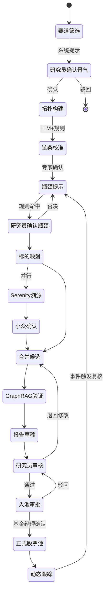

# 人机协同流程

## 1. 设计原则

- **机器起草，人工定稿**
- **关键节点必须人工确认**，系统不得跳过
- **人工覆盖必须留痕**：谁、何时、何理由
- **覆盖结果回写知识库**，形成演化闭环

## 2. 用户角色

| 角色 | 职责 | 系统权限 |
|------|------|---------|
| 产业研究员 | 赛道研判、链条校准、候选池确认 | 图谱编辑、入池确认、报告审核 |
| 基金经理 | 组合决策、仓位 | 查看报告、批注、最终入池审批 |
| 风控 | 风险复核 | 查看反证、否决权 |
| 知识管理员 | 本体与数据治理 | 版本发布、源配置 |
| 系统管理员 | 账号与审计 | 全权限 |

## 3. 必经人工确认节点

| 节点 | 系统输出 | 人工动作 | 未确认后果 |
|------|---------|---------|-----------|
| 赛道景气确认 | `beta_candidate` 列表 | 确认/驳回 | 不进入后续流程 |
| 产业链链条 | LLM 抽取的拓扑 | 校准/确认 | 关系保持 draft |
| 瓶颈标签 | `bottleneck_hint` | 确认→`confirmed` / 否决 | 仅作提示，不入买方池 |
| Serenity 小众 | `serenity_niche` 候选 | 确认/剔除 | 不进入 Serenity 池 |
| LLM 报告草稿 | 投研逻辑 + 反证 | 审核/修改/发布 | 不可对外展示 |
| 候选入池 | 各模式候选清单 | **入池确认** | 不进入正式股票池 |
| 风险否决 | 反证告警 | 风控确认 | 自动从候选移除 |

## 4. 标准工作流



## 5. 人工覆盖机制

### 5.1 覆盖类型

| 类型 | 场景 | 必填字段 |
|------|------|---------|
| 否决 | 不同意系统瓶颈判定 | 理由、替代判断 |
| 强制入池 | 系统未推荐但研究员坚持 | 理由、风险自述 |
| 强制出池 | 系统推荐但研究员否决 | 理由 |
| 属性修正 | 修正产能、周期等数值 | 新值、来源 |
| 关系修正 | 修正上下游 | 新关系、证据 |

### 5.2 覆盖记录模型

```json
{
  "override_id": "uuid",
  "target_type": "assertion | relation | pool_entry",
  "target_id": "...",
  "action": "reject | approve | modify",
  "original_value": {},
  "new_value": {},
  "reason": "必填，不少于20字",
  "operator_id": "analyst_001",
  "operator_role": "researcher",
  "created_at": "2025-06-17T10:00:00Z",
  "synced_to_kg": true
}
```

## 6. 界面交互要求

### 6.1 候选池界面

- 每条候选展示：逻辑摘要、提示分、证据数、反证数
- 操作按钮：**确认入池** / **否决** / **待定**
- 否决时弹出理由输入框（必填）
- 已确认项显示确认人与时间

### 6.2 报告审核界面

- 左侧：报告正文（段落级 citation 可点击）
- 右侧：溯源面板、反证清单、人工批注
- 底部：**通过发布** / **退回修改** / **仅保存草稿**

### 6.3 图谱校准界面

- 支持拖拽新增关系、右键删除、属性 inline 编辑
- 未确认关系以虚线/灰色显示
- 保存时强制填写变更理由

## 7. 与定量提示的协同

| 场景 | 系统行为 | 人工行为 |
|------|---------|---------|
| 提示分 85，研究员不认同 | 展示分数与规则命中项 | 可否决并标注「定性不成立」 |
| 提示分 45，研究员看好 | 标注「人工提升关注」 | 可强制加入观察池 |
| 多标的排序 | 默认按提示分排序 | 可手动拖拽排序，记录理由 |

**排序仅为建议顺序，不等于推荐强度。**

## 8. 审计与合规

- 所有入池/出池/覆盖操作写入审计日志，保留 ≥ 3 年
- 报告发布记录版本号与审核人
- 系统界面固定免责声明：不构成投资建议
