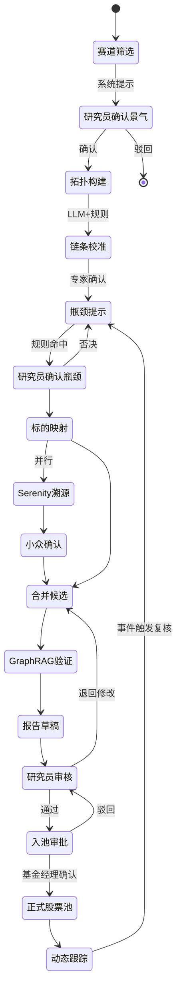

# 人机协同流程

## 1. 设计原则

- **机器起草，人工定稿**
- **关键节点必须人工确认**，系统不得跳过
- **人工覆盖必须留痕**：谁、何时、何理由
- **覆盖结果回写知识库**，形成演化闭环

## 2. 用户角色

| 角色 | 职责 | 系统权限 |
|------|------|---------|
| 产业研究员 | 赛道研判、链条校准、候选池确认 | 图谱编辑、入池确认、报告审核 |
| 基金经理 | 组合决策、仓位 | 查看报告、批注、最终入池审批 |
| 风控 | 风险复核 | 查看反证、否决权 |
| 知识管理员 | 本体与数据治理 | 版本发布、源配置 |
| 系统管理员 | 账号与审计 | 全权限 |

## 3. 必经人工确认节点

| 节点 | 系统输出 | 智能体（如有） | 人工动作 | 未确认后果 |
|------|---------|---------------|---------|-----------|
| 赛道景气确认 | `beta_candidate` / 推荐提案 | SectorRecommendAgent | 采纳 + ConfirmSectorBeta | 不进入后续流程 |
| 产业链链条 | LLM 抽取拓扑 | KnowledgeIngestAgent | CalibrateChain | 关系保持 draft |
| 瓶颈标签 | `bottleneck_hint` | BottleneckScoutAgent | ConfirmBottleneck | 仅提示，不入买方池 |
| 瓶颈缓解 | `bottleneck_easing` 提议 | MonitorWatchAgent | ConfirmBottleneckEasing | 失效瓶颈仍占用买方池 |
| Serenity 小众 | `serenity_niche` | SerenityPathAgent | ConfirmSerenityNiche | 不进 Serenity 池 |
| 看多报告草稿 | 看多逻辑链 | ReportGraphRAGAgent | PublishReport 审核 | 不可对外展示 |
| **空头论点回应** | 看空论点（BearCase） | BearCaseAgent | **RebutBearCase（正面回应）** | **高severity 未回应 → 阻断入池** |
| 候选入池 | 候选清单 + 三道闸 | CandidateFusionAgent | ApprovePoolEntry | 不进正式池 |
| 动态复核 | 告警 | MonitorWatchAgent | 按类型确认 | 风险滞留 |

> **原则**：Agent 写提案表（`proposed`），Action 执行器写权威 Ontology。

### 3.2 摩擦预算分级（v3.0）

> 把双人复核与长理由集中到真正高风险处，低风险动作减负，避免研究员绕过系统。对齐主册 [DESIGN.md §8.4](./DESIGN.md)。

| 风险层 | 节点 | 约束强度 |
|--------|------|---------|
| **高风险闸** | 候选入池、报告发布、瓶颈确认 | 强约束 + **双人复核** + 理由 ≥ 20 字 + 三道闸全过 |
| **中风险闸** | 赛道景气确认、Serenity 小众确认、瓶颈缓解确认、空头论点回应 | 单人确认 + 简短理由 |
| **低风险** | 链条 draft 校准、属性微调 | 默认通过 / 批量确认 / 事后抽审 |

## 3.1 用户五步上手（前端 WorkflowGuide）

① 发现赛道 → ② 研判产业（上传研报=知识增强）→ ③ 筛选标的 → ④ 论证报告 → ⑤ 确认入池

## 4. 标准工作流



## 5. 人工覆盖机制

### 5.1 覆盖类型

| 类型 | 场景 | 必填字段 |
|------|------|---------|
| 否决 | 不同意系统瓶颈判定 | 理由、替代判断 |
| 强制入池 | 系统未推荐但研究员坚持 | 理由、风险自述 |
| 强制出池 | 系统推荐但研究员否决 | 理由 |
| 属性修正 | 修正产能、周期等数值 | 新值、来源 |
| 关系修正 | 修正上下游 | 新关系、证据 |

### 5.2 覆盖记录模型

```json
{
  "override_id": "uuid",
  "target_type": "assertion | relation | pool_entry",
  "target_id": "...",
  "action": "reject | approve | modify",
  "original_value": {},
  "new_value": {},
  "reason": "必填，不少于20字",
  "operator_id": "analyst_001",
  "operator_role": "researcher",
  "created_at": "2025-06-17T10:00:00Z",
  "synced_to_kg": true
}
```

## 6. 界面交互要求

### 6.1 候选池界面

- 每条候选展示：逻辑摘要、提示分（含保鲜状态）、证据数
- **三道闸结果卡**：预期差（priced_in）/ 价值捕获（captures_economics）/ 空头论点回应状态
- 操作按钮：**确认入池** / **否决** / **待定**；高severity 空头论点未回应时入池按钮**置灰**
- 否决时弹出理由输入框（必填）
- 已确认项显示确认人与时间

### 6.2 报告审核界面（多空对照）

- 左侧：看多报告正文（段落级 citation 可点击）
- **中部：看空论点（BearCase）并排，逐条显示 severity / 回应状态**；每条提供 `RebutBearCase` 回应框
- 右侧：溯源面板、人工批注
- 底部：**通过发布** / **退回修改** / **仅保存草稿**（高severity 空头论点未回应时**禁止发布/入池**）

### 6.3 图谱校准界面

- 支持拖拽新增关系、右键删除、属性 inline 编辑
- 未确认关系以虚线/灰色显示
- 保存时强制填写变更理由

## 7. 与定量提示的协同

| 场景 | 系统行为 | 人工行为 |
|------|---------|---------|
| 提示分 85，研究员不认同 | 展示分数与规则命中项 | 可否决并标注「定性不成立」 |
| 提示分 45，研究员看好 | 标注「人工提升关注」 | 可强制加入观察池 |
| 多标的排序 | 默认按提示分排序 | 可手动拖拽排序，记录理由 |

**排序仅为建议顺序，不等于推荐强度。**

## 8. 审计与合规

- 所有入池/出池/覆盖操作写入审计日志，保留 ≥ 3 年
- 报告发布记录版本号与审核人
- 系统界面固定免责声明：不构成投资建议
