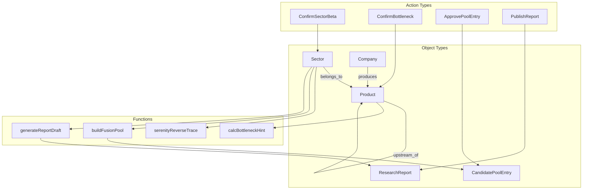

# Palantir Ontology 语义层实现方案

> 本文档说明如何借鉴 **Palantir Foundry Ontology** 的设计理念，在 AiStock 开源技术栈上实现「语义层 + 操作层」一体化的知识工程架构。  
> **说明**：本项目不依赖 Palantir 商业产品，而是采用其 Ontology 方法论进行自建实现。

---

## 1. 为什么引入 Palantir Ontology

### 1.1 传统 OWL + 图谱的局限

| 局限 | 表现 |
|------|------|
| 只读语义 | OWL/Neo4j 擅长「是什么」，弱于「谁做了什么变更」 |
| 数据与语义割裂 | 财报 API、研报 PDF 与 Product 对象之间缺统一映射 |
| 人工流程难建模 | 入池确认、瓶颈裁定等操作无法作为一等公民 |
| 应用重复造轮子 | 每个 API 自行拼装对象、关系、权限 |

### 1.2 Palantir Ontology 的核心价值

Palantir Ontology 是覆盖在数据集之上的 **业务语义层（Semantic Layer）**，将底层数据映射为：

| 概念 | 含义 | AiStock 对应 |
|------|------|-------------|
| **Object Type** | 业务对象类型 | Product、Company、Sector、Candidate |
| **Property** | 对象属性 | expansion_cycle_months、hint_score |
| **Link Type** | 对象间关系 | UPSTREAM_OF、PRODUCES |
| **Action Type** | 可执行业务操作（含人工） | ConfirmBottleneck、ApprovePoolEntry |
| **Function** | 派生/计算逻辑 | calcBottleneckHint、serenityReverseTrace |
| **Interface** | 跨类型共享能力 | Scorable、Traceable、Reviewable |
| **Object Set** | 对象集合查询 | BottleneckProducts、SerenityCandidates |

**关键差异**：Ontology 不仅是 schema，更是 **可写回（Writeback）的操作系统**——人工确认、专家校准、入池审批都建模为 Action，自动留痕并更新对象状态。

### 1.3 与 AiStock 定位的契合

```
定性投研 = 对象状态流转（draft → confirmed）+ 证据挂载 + 人工 Action
知识工程 = Object/Link 的溯源与版本
双逻辑选股 = Function 计算 + Object Set 筛选 + Action 入池
```

---

## 2. 总体架构：Ontology 语义层

```
┌─────────────────────────────────────────────────────────────────────┐
│  应用层   React · G6 · 候选池 · 报告审核 · Ontology-aware API       │
├─────────────────────────────────────────────────────────────────────┤
│  Ontology 运行时                                                     │
│  ┌─────────────┬─────────────┬─────────────┬─────────────────────┐ │
│  │ Object SDK  │ Action 引擎 │ Function 注册│ Object Set 查询器    │ │
│  └─────────────┴─────────────┴─────────────┴─────────────────────┘ │
├─────────────────────────────────────────────────────────────────────┤
│  Ontology 注册表（Git 版本化）                                        │
│  object_types.yaml · link_types.yaml · action_types.yaml · functions │
├─────────────────────────────────────────────────────────────────────┤
│  物化层（Materialization）                                            │
│  PostgreSQL 对象表 │ Neo4j 图投影 │ Qdrant 文档索引                  │
├─────────────────────────────────────────────────────────────────────┤
│  数据管道（Pipeline）                                                 │
│  ODS 原始层 → 清洗 → 映射到 Object Property → 触发 Function 重算     │
├─────────────────────────────────────────────────────────────────────┤
│  数据源   Wind/iFinD · 巨潮公告 · 研报 PDF · 专家 Excel              │
└─────────────────────────────────────────────────────────────────────┘
```

### 2.1 与现有六层架构的映射

| 原六层 | Palantir Ontology 增强 |
|--------|----------------------|
| 数据接入层 | Pipeline 写入 **Backing Dataset**，再物化为 Object |
| 本体建模层 | **Ontology Registry**（Object/Link/Action/Function 定义） |
| 知识抽取层 | 抽取结果写回 Object Property（status=draft） |
| 推理引擎层 | 实现为 **Ontology Function** |
| 业务应用层 | 通过 **Action API** 驱动状态变更 |
| 前端层 | 绑定 Object Type 视图与 Action 表单 |

---

## 3. Ontology 元模型定义

### 3.1 Object Type（对象类型）

**定义文件**：`ontology/registry/object_types.yaml`

```yaml
object_types:
  Product:
    display_name: 产业链产品
    primary_key: id
    title_property: name
    backing:
      table: ont_product
      sync_mode: upsert
    properties:
      id:           { type: string,  required: true }
      name:         { type: string,  required: true }
      layer:        { type: enum,    values: [terminal, mid, material, consumable] }
      expansion_cycle_months: { type: integer, source: pipeline.industry_metric }
      cr4_concentration:      { type: float,   source: pipeline.industry_metric }
      bottleneck_status:
        type: enum
        values: [none, bottleneck_hint, bottleneck_confirmed, bottleneck_easing, bottleneck_expired]
        writable_by: [action.ConfirmBottleneck, action.RejectBottleneck, action.ConfirmBottleneckEasing]
      serenity_niche: { type: boolean }
      # v3.0 保鲜字段（Perishable 接口）
      half_life_days:   { type: integer }
      valid_until:      { type: date }
      freshness:        { type: enum, values: [fresh, aging, stale] }
    interfaces: [Scorable, Traceable, Perishable]
    functions:
      - calcBottleneckHint
    permissions:
      read:  [researcher, analyst, viewer]
      write: [researcher, knowledge_admin]

  Company:
    display_name: 上市公司
    primary_key: code
    title_property: name
    backing:
      table: ont_company
    properties:
      code: { type: string }
      name: { type: string }
      market_cap_billion: { type: float, source: pipeline.market_daily }
      analyst_coverage:   { type: integer, source: pipeline.research_coverage }
      turnover_percentile:{ type: float, source: pipeline.market_daily }
    links:
      - produces_products

  Sector:
    display_name: 行业赛道
    primary_key: id
    properties:
      id: { type: string }
      name: { type: string }
      status: { type: enum, values: [beta_candidate, beta_confirmed, rejected] }
      demand_growth_hint: { type: float }

  CandidatePoolEntry:
    display_name: 候选池条目
    primary_key: entry_id
    backing:
      table: ont_candidate_entry
    properties:
      entry_id:   { type: string }
      stock_code: { type: string }
      sector_id:  { type: string }
      mode:       { type: enum, values: [buy_side, serenity, fusion] }
      status:     { type: enum, values: [pending, confirmed, rejected] }
      priority:   { type: enum, values: [P0, P1, P2] }
      hint_score: { type: float, derived: true }
      # v3.0 入池三道闸结果（主册 §2.6）
      edge_assessment:  { type: json }    # 闸一 预期差 {priced_in, ...}
      value_capture:    { type: json }    # 闸二 价值捕获 {captures_economics, ...}
      bear_rebut_status:{ type: enum, values: [none, unrebutted, rebutted] }  # 闸三
    writable_by: [action.ApprovePoolEntry, action.RejectPoolEntry, action.RebutBearCase]

  ResearchReport:
    display_name: 投研报告
    primary_key: report_id
    properties:
      report_id: { type: string }
      status:    { type: enum, values: [draft, published, rejected] }
      logic_chain: { type: json }
    writable_by: [action.PublishReport, action.RejectReport]

  KnowledgeAssertion:
    display_name: 知识断言
    primary_key: id
    backing:
      table: knowledge_assertion
    properties:
      id: { type: uuid }
      entity_type: { type: string }
      entity_id: { type: string }
      property: { type: string }
      value: { type: json }
      status: { type: enum, values: [draft, pending, confirmed, rejected, deprecated] }

  SectorRecommendation:
    display_name: 赛道推荐提案
    primary_key: rec_id
    backing:
      table: ont_sector_recommendation
    properties:
      rec_id: { type: string }
      sector_id: { type: string, nullable: true }
      sector_name: { type: string }
      beta_score: { type: float }
      rationale: { type: text }
      status: { type: enum, values: [proposed, adopted, dismissed] }
      agent_mode: { type: string }
      run_id: { type: string }
    writable_by: [action.AdoptSectorRecommendation, action.DismissSectorRecommendation]
    interfaces: [Traceable]

  BearCase:                       # v3.0：看空论点（反证一等对象）
    display_name: 看空论点
    primary_key: bear_id
    backing:
      table: ont_bear_case
    properties:
      bear_id:        { type: string }
      candidate_id:   { type: string }
      risk:           { type: text }
      dimension:      { type: enum, values: [技术替代, 新增扩产, 需求下滑, 估值透支, 政策风险, 客户集中度, 库存累积] }
      severity:       { type: enum, values: [low, medium, high] }
      probability:    { type: enum, values: [low, medium, high] }
      what_would_confirm: { type: text }
      rebuttal:       { type: text, nullable: true }
      rebuttal_status:{ type: enum, values: [unrebutted, rebutted] }
    writable_by: [action.RebutBearCase]
    interfaces: [Traceable]
```

### 3.2 Link Type（链接类型）

**定义文件**：`ontology/registry/link_types.yaml`

```yaml
link_types:
  upstream_of:
    display_name: 上游关系
    from: Product
    to: Product
    cardinality: many_to_many
    backing:
      table: ont_link_upstream
      columns: { from_id: source_product_id, to_id: target_product_id }
    properties:
      cost_ratio: { type: float }
      lead_time_months: { type: integer }
    writable_by: [action.CalibrateChain]

  produces:
    display_name: 公司生产
    from: Company
    to: Product
    cardinality: many_to_many
    backing:
      table: ont_link_produces

  belongs_to:
    display_name: 所属赛道
    from: Product
    to: Sector
    cardinality: many_to_one

  triggers:
    display_name: 事件驱动
    from: Event
    to: Product
    cardinality: many_to_many
```

### 3.3 Interface（接口）

跨 Object Type 的共享能力，类似 Palantir Interface：

```yaml
interfaces:
  Scorable:
  description: 可计算提示分的对象
  properties:
    hint_score: { type: float, derived: true }
    hint_level: { type: string, derived: true }

  Traceable:
  description: 可溯源对象
  properties:
    provenance_ids: { type: array, items: string }
    confidence:     { type: float }

  Reviewable:
  description: 需人工审核对象
  properties:
    status:        { type: string }
    reviewed_by:   { type: string }
    reviewed_at:   { type: datetime }

  Perishable:                     # v3.0：可保鲜/有半衰期对象
  description: 知识有时效，过期自动降级
  properties:
    half_life_days: { type: integer }
    valid_until:    { type: date }
    freshness:      { type: string }   # fresh / aging / stale
```

### 3.4 Function（函数）

**定义文件**：`ontology/registry/functions.yaml`

Ontology Function 是挂载在 Object Type 上的 **纯计算逻辑**，结果可缓存、可审计：

```yaml
functions:
  calcBottleneckHint:
    display_name: 瓶颈提示分
    applies_to: [Product]
    inputs: [product_id]
    output: ScoreCard
    implementation: app.ontology.functions.calc_bottleneck_hint
    cache_ttl: 3600
    disclaimer: 辅助排序提示，非投资决策

  serenityReverseTrace:
    display_name: Serenity逆向溯源
    applies_to: [Sector]
    inputs: [sector_id, terminal_product_ids]
    output: TracePathList
    implementation: app.ontology.functions.serenity_reverse_trace

  buildFusionPool:
    display_name: 双逻辑融合候选池
    applies_to: [Sector]
    inputs: [sector_id]
    output: ObjectSet[CandidatePoolEntry]
    implementation: app.ontology.functions.build_fusion_pool

  generateReportDraft:
    display_name: GraphRAG报告草稿（看多）
    applies_to: [Sector]
    inputs: [sector_id, mode]
    output: ResearchReport
    implementation: app.ontology.functions.generate_report_draft

  # v3.0 新增：入池三道闸 + 反证
  edgeSignal:
    display_name: 预期差信号（闸一）
    applies_to: [Company]
    inputs: [stock_code]
    output: EdgeAssessment
    implementation: app.ontology.functions.edge_signal
    disclaimer: 度量市场 price-in，非投资决策

  valueCapture:
    display_name: 价值捕获研判（闸二）
    applies_to: [Company]
    inputs: [product_id, company_code]
    output: ValueCaptureCard
    implementation: app.ontology.functions.value_capture

  generateBearCase:
    display_name: 看空论点生成（闸三，独立检索）
    applies_to: [CandidatePoolEntry]
    inputs: [candidate_id]
    output: BearCaseList
    implementation: app.ontology.functions.generate_bear_case
```

**与现有代码映射：**

| Function | 现有模块 |
|----------|---------|
| calcBottleneckHint | `services/hint_score.py` |
| serenityReverseTrace | `services/serenity_trace.py` |
| buildFusionPool | `services/candidate_pool.py` |
| generateReportDraft | `services/report.py` |
| edgeSignal | `services/edge_signal.py` 🆕 |
| valueCapture | `services/value_capture.py` 🆕 |
| generateBearCase | `services/bearcase.py` 🆕 |

### 3.5 Action Type（操作类型）— 核心

Action 是 Palantir Ontology 区别于传统 KG 的关键：**把人工投研流程建模为可执行、可审计的业务操作**。

**定义文件**：`ontology/registry/action_types.yaml`

```yaml
action_types:
  ConfirmSectorBeta:
    display_name: 确认赛道景气
    target: Sector
    parameters:
      - { name: reason, type: string, required: true, min_length: 5 }
    effects:
      - set: { property: status, value: beta_confirmed }
      - set: { property: human_confirmed, value: true }
    side_effects:
      - audit_log
      - notify: knowledge_admin
    permissions: [researcher]
    requires_dual_review: false

  ConfirmBottleneck:
    display_name: 确认瓶颈环节
    target: Product
    preconditions:
      - property bottleneck_status == bottleneck_hint
    parameters:
      - { name: reason, type: string, required: true }
    effects:
      - set: { property: bottleneck_status, value: bottleneck_confirmed }
    side_effects:
      - write_knowledge_assertion
      - sync_neo4j
      - audit_log
    permissions: [researcher]
    requires_dual_review: true

  CalibrateChain:
    display_name: 校准产业链关系
    target: Link[upstream_of]
    parameters:
      - { name: operation, type: enum, values: [add, remove, modify] }
      - { name: source_id, type: string }
      - { name: target_id, type: string }
      - { name: reason, type: string, required: true }
      - { name: evidence_refs, type: array }
    effects:
      - mutate_link
    side_effects:
      - audit_log
      - invalidate_function: serenityReverseTrace
    permissions: [researcher]

  ApprovePoolEntry:
    display_name: 确认入池
    target: CandidatePoolEntry
    preconditions:
      - property status == pending
      - validation: passed_three_gates       # v3.0 三道闸：预期差/价值捕获/反证
      - property bear_rebut_status != unrebutted  # 高severity 空头未回应则阻断
    parameters:
      - { name: reason, type: string, required: true, min_length: 5 }
    effects:
      - set: { property: status, value: confirmed }
    side_effects:
      - audit_log
    permissions: [researcher, fund_manager]
    requires_dual_review: true

  RejectPoolEntry:
    display_name: 否决候选
    target: CandidatePoolEntry
    parameters:
      - { name: reason, type: string, required: true }
    effects:
      - set: { property: status, value: rejected }
    side_effects:
      - audit_log
    permissions: [researcher, risk]

  PublishReport:
    display_name: 发布投研报告
    target: ResearchReport
    preconditions:
      - property status == draft
      - validation: all_claims_have_citations
      - validation: no_unrebutted_high_bear   # v3.0：高severity 空头论点须已回应
    parameters:
      - { name: comments, type: string }
    effects:
      - set: { property: status, value: published }
    permissions: [researcher]
    requires_dual_review: true

  # v3.0 新增 Action
  ConfirmBottleneckEasing:
    display_name: 确认瓶颈缓解/失效
    target: Product
    preconditions:
      - property bottleneck_status == bottleneck_confirmed
    parameters:
      - { name: new_status, type: enum, values: [bottleneck_easing, bottleneck_expired] }
      - { name: reason, type: string, required: true }
      - { name: evidence_refs, type: array }
    effects:
      - set: { property: bottleneck_status, value: $new_status }
    side_effects:
      - write_knowledge_assertion
      - sync_neo4j
      - audit_log
      - invalidate_function: buildFusionPool
    permissions: [researcher]

  RebutBearCase:
    display_name: 回应空头论点
    target: BearCase
    parameters:
      - { name: rebuttal, type: string, required: true, min_length: 10 }
    effects:
      - set: { property: rebuttal_status, value: rebutted }
    side_effects:
      - audit_log
    permissions: [researcher]
```

### 3.6 Object Set（对象集）

预定义查询视图，供应用层与 Function 复用：

```yaml
object_sets:
  BetaConfirmedSectors:
    object_type: Sector
    filter: { status: beta_confirmed }

  BottleneckProducts:
    object_type: Product
    filter:
      bottleneck_status: { in: [bottleneck_hint, bottleneck_confirmed] }

  SerenityNicheProducts:
    object_type: Product
    filter: { serenity_niche: true }

  PendingCandidates:
    object_type: CandidatePoolEntry
    filter: { status: pending }

  P0FusionCandidates:
    object_type: CandidatePoolEntry
    filter: { mode: fusion, priority: P0, status: pending }

  ProposedSectorRecommendations:
    object_type: SectorRecommendation
    filter: { status: proposed }

  # v3.0 新增
  StaleKnowledge:
    object_type: KnowledgeAssertion
    filter: { freshness: stale, status: confirmed }

  EasingBottlenecks:
    object_type: Product
    filter:
      bottleneck_status: { in: [bottleneck_easing, bottleneck_expired] }

  UnrebuttedBearCases:
    object_type: BearCase
    filter: { severity: high, rebuttal_status: unrebutted }
```

---

## 4. 技术实现

### 4.1 目录结构（建议）

```
aistock/
├── ontology/
│   ├── registry/                  # Ontology 定义（Git 版本化）
│   │   ├── object_types.yaml
│   │   ├── link_types.yaml
│   │   ├── action_types.yaml
│   │   ├── functions.yaml
│   │   ├── interfaces.yaml
│   │   └── object_sets.yaml
│   ├── owl/                       # OWL 互操作（FIBO 对齐）
│   │   └── aistock.owl
│   └── migrations/                # 对象表 DDL 版本
│
├── backend/app/ontology/          # Ontology 运行时
│   ├── registry.py                # 加载 YAML 注册表
│   ├── object_store.py            # PostgreSQL 对象 CRUD
│   ├── link_store.py              # 链接 CRUD
│   ├── action_executor.py         # Action 执行引擎
│   ├── function_runtime.py        # Function 注册与调用
│   ├── object_set_query.py        # Object Set 查询
│   ├── materializer.py            # Pipeline → Object 物化
│   ├── permissions.py               # 基于角色的 Action 鉴权
│   └── graph_projector.py         # PostgreSQL/Registry → Neo4j 投影
```

### 4.2 Ontology 运行时核心流程

#### 读取对象

```python
# 伪代码
product = ontology.objects.get("Product", "prod_cowos")
score   = ontology.functions.call("calcBottleneckHint", product_id="prod_cowos")
links   = ontology.links.outgoing(product, "upstream_of")
```

#### 执行 Action（入池确认）

```python
result = ontology.actions.execute(
    action_type="ApprovePoolEntry",
    target=("CandidatePoolEntry", entry_id),
    params={"reason": "双逻辑共振，CoWoS 瓶颈+磷化铟小众配套"},
    operator="analyst_zhang",
)
# 自动：前置条件校验 → 更新对象状态 → 审计日志 → 可选双人复核队列
```

#### 物化管道

```python
# Celery 任务：Wind API → ODS → Ontology Materializer
materializer.sync_property(
    object_type="Company",
    object_id="600519",
    property="market_cap_billion",
    value=2.1,
    source="pipeline.market_daily",
    confidence=1.0,
)
materializer.invalidate_functions("Company", "600519", ["buildFusionPool"])
```

### 4.3 存储分工（避免双写混乱）

| 数据 | 存储 | 说明 |
|------|------|------|
| Object 属性（权威） | PostgreSQL `ont_*` | Ontology 单一事实源 |
| Link 关系（权威） | PostgreSQL `ont_link_*` | 校准后 status=confirmed |
| 图遍历投影 | Neo4j | 由 `graph_projector` 异步同步 |
| 证据溯源 | PostgreSQL `knowledge_*` | 挂载到 Object Property |
| 向量索引 | Qdrant | 研报 chunk，挂 citation ref |
| 派生属性缓存 | Redis | Function 结果缓存 |

```
PostgreSQL (Ontology 权威)  ──project──▶  Neo4j (读优化)
         │
         └──provenance──▶  knowledge_assertion
```

### 4.4 OWL 与 Palantir Ontology 的双轨制

| 层次 | 技术 | 职责 |
|------|------|------|
| 逻辑约束层 | OWL (Protégé + owlready2) | 类层次、约束校验、推理（如矛盾检测） |
| 操作语义层 | Palantir-style Registry | Object/Link/Action/Function、权限、物化 |
| 图遍历层 | Neo4j | 多跳查询、可视化 |

**同步策略**：Registry 变更 → 导出/校验 OWL → Git tag 版本对齐。

### 4.5 API 设计（Ontology-native）

在现有 REST 之上增加 Ontology 语义 API：

```
# 对象
GET  /api/v1/ontology/objects/{type}/{id}
GET  /api/v1/ontology/object-sets/{set_name}

# 函数
POST /api/v1/ontology/functions/{name}/invoke
     body: { "inputs": { "product_id": "prod_cowos" } }

# 操作（替代散落的 confirm 端点，逐步迁移）
POST /api/v1/ontology/actions/{action_type}/execute
     body: {
       "target": { "type": "CandidatePoolEntry", "id": "..." },
       "params": { "reason": "..." }
     }

# 元数据（供前端动态渲染表单）
GET  /api/v1/ontology/registry/action-types
GET  /api/v1/ontology/registry/object-types
```

现有 `/candidates/confirm` 等端点一期保留，二期统一收敛到 Action API。

---

## 5. 与双投研逻辑的 Ontology 映射



| 投研步骤 | Ontology 实现 |
|---------|--------------|
| Step1 确认赛道 Beta | Action: `ConfirmSectorBeta` on Sector |
| Step2 校准拓扑 | Action: `CalibrateChain` on Link |
| Step3 瓶颈确认 | Function: `calcBottleneckHint` → Action: `ConfirmBottleneck` |
| Step4 Serenity 溯源 | Function: `serenityReverseTrace` → Object Set |
| Step5 看多报告 | Function: `generateReportDraft` → Action: `PublishReport` |
| Step5' 看空对抗 | Function: `generateBearCase` → Action: `RebutBearCase` |
| Step6 三道闸入池 | Function: `edgeSignal`/`valueCapture` + 反证 → Action: `ApprovePoolEntry`（三道闸为前置条件） |
| Step7 动态跟踪/保鲜 | Pipeline 更新 Property → 保鲜状态机 → Action: `ConfirmBottleneckEasing` → 告警 |

---

## 6. 前端 Ontology-aware 设计

### 6.1 动态 Action 表单

前端从 Registry 拉取 Action Type 定义，自动渲染参数表单（reason、evidence_refs 等），无需为每个操作硬编码 UI。

```typescript
// 伪代码
const actionMeta = await ontology.getActionType("ApprovePoolEntry");
<ActionForm schema={actionMeta.parameters} onSubmit={executeAction} />
```

### 6.2 Object 详情页

统一 Object 详情组件：属性表 + 溯源面板 + 可用 Action 列表 + 关联 Link 可视化。

### 6.3 Object Set 驱动的列表页

候选池页面 = `ObjectSet: PendingCandidates` + 按 mode 过滤，而非硬编码 API 字段。

---

## 7. 权限与安全

借鉴 Palantir 的 **对象级权限**：

```yaml
# ontology/registry/permissions.yaml
roles:
  researcher:
    actions: [ConfirmSectorBeta, ConfirmBottleneck, CalibrateChain, ApprovePoolEntry, PublishReport]
    object_sets: [BottleneckProducts, PendingCandidates]
  fund_manager:
    actions: [ApprovePoolEntry]
  risk:
    actions: [RejectPoolEntry]
  viewer:
    actions: []
    object_sets: [BetaConfirmedSectors]
```

Action 执行前校验：`operator.role` 是否在 `action.permissions` 内。

---

## 8. 实施路线

### 8.1 一期（MVP 增强，1–2 周）

- [x] 建立 `ontology/registry/*.yaml` 注册表
- [x] 实现 `registry.py` + `action_executor.py` 最小版
- [x] 将 `ConfirmPoolEntry` / `RejectPoolEntry` 迁移为 Action API（`/candidates/confirm` 已委托）
- [x] 将 `hint_score` / `serenity_trace` / `candidate_pool` / `report` 注册为 Function
- [ ] 种子数据从 JSON 物化为 PostgreSQL `ont_*` 表（仍用内存种子）

### 8.2 二期（2–3 月）

- [ ] PostgreSQL `ont_*` 表作为权威存储
- [ ] `materializer` 接入 Wind/公告 Pipeline
- [ ] `graph_projector` 同步 Neo4j
- [ ] 专家校准 UI 绑定 `CalibrateChain` Action
- [ ] 前端 Action 动态表单

### 8.3 三期

- [ ] 双人复核工作流内置于 Action 引擎
- [ ] OWL 约束与 Registry 自动一致性校验
- [ ] Object Set 驱动的看板与告警
- [ ] CBR 案例作为 Object Type `HistoricalCase`

---

## 9. 与 Palantir Foundry 的差异说明

| 能力 | Palantir Foundry | AiStock 自建 |
|------|-----------------|-------------|
| Ontology 编辑器 | Foundry UI | YAML + Git + 可选自建 Admin UI |
| Pipeline | Foundry Pipeline | Celery + Python ETL |
| Action 运行时 | Foundry Actions | `action_executor.py` |
| 权限 | Foundry RBAC/MLP | PostgreSQL + FastAPI 中间件 |
| 对象存储 | Ontology Object DB | PostgreSQL + Neo4j 投影 |
| LLM | AIP | DeepSeek/GLM API + GraphRAG |

**结论**：复用方法论，不绑定商业产品，保持开源可控与定性投研定位。

---

## 10. 验收标准

| 项 | 标准 |
|----|------|
| Registry 完整性 | 核心 7 个 Object Type（含 BearCase）、5 个 Link Type、8 个 Action Type（含 ConfirmBottleneckEasing/RebutBearCase）定义完整 |
| 三道闸闭环 | `edgeSignal`/`valueCapture`/`generateBearCase` 注册为 Function，入池前置条件校验三道闸 |
| 保鲜状态机 | Perishable 对象 `freshness` 自动流转，`stale` 进 `StaleKnowledge` 并降权 |
| Action 可追溯 | 每次执行产生 audit + 对象状态变更 |
| Function 可复用 | 同一 Function 可被 API、报告、Object Set 共用 |
| 物化一致性 | PostgreSQL 与 Neo4j 投影延迟 < 5min |
| 前端动态化 | 入池/否决 UI 由 Action Schema 驱动 |
