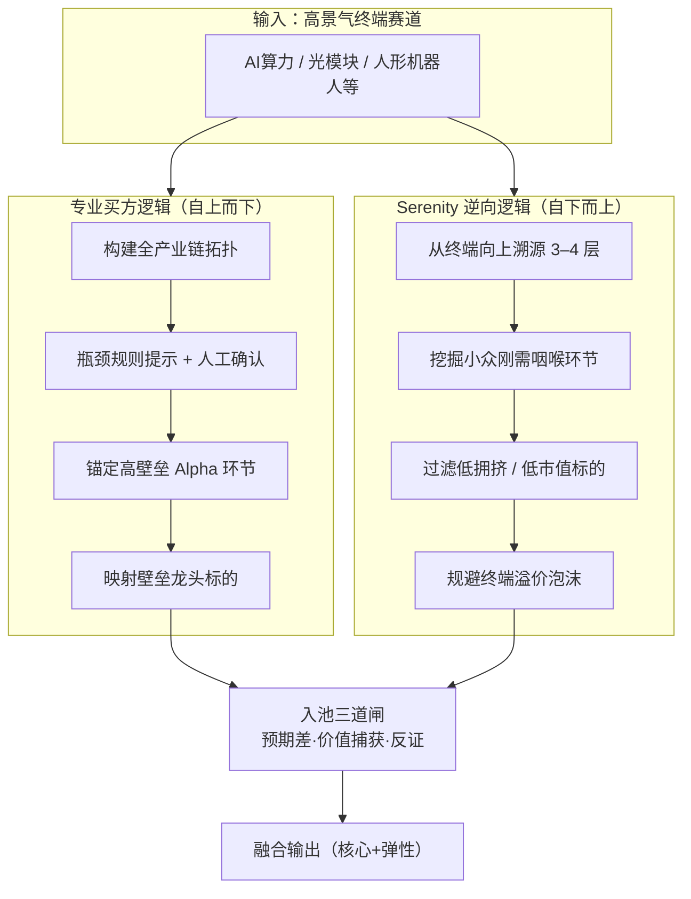
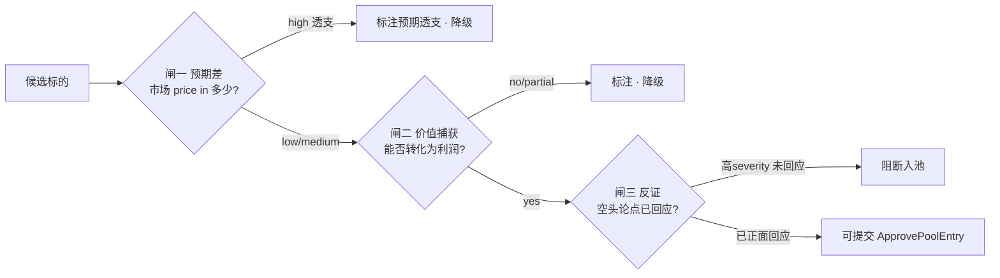
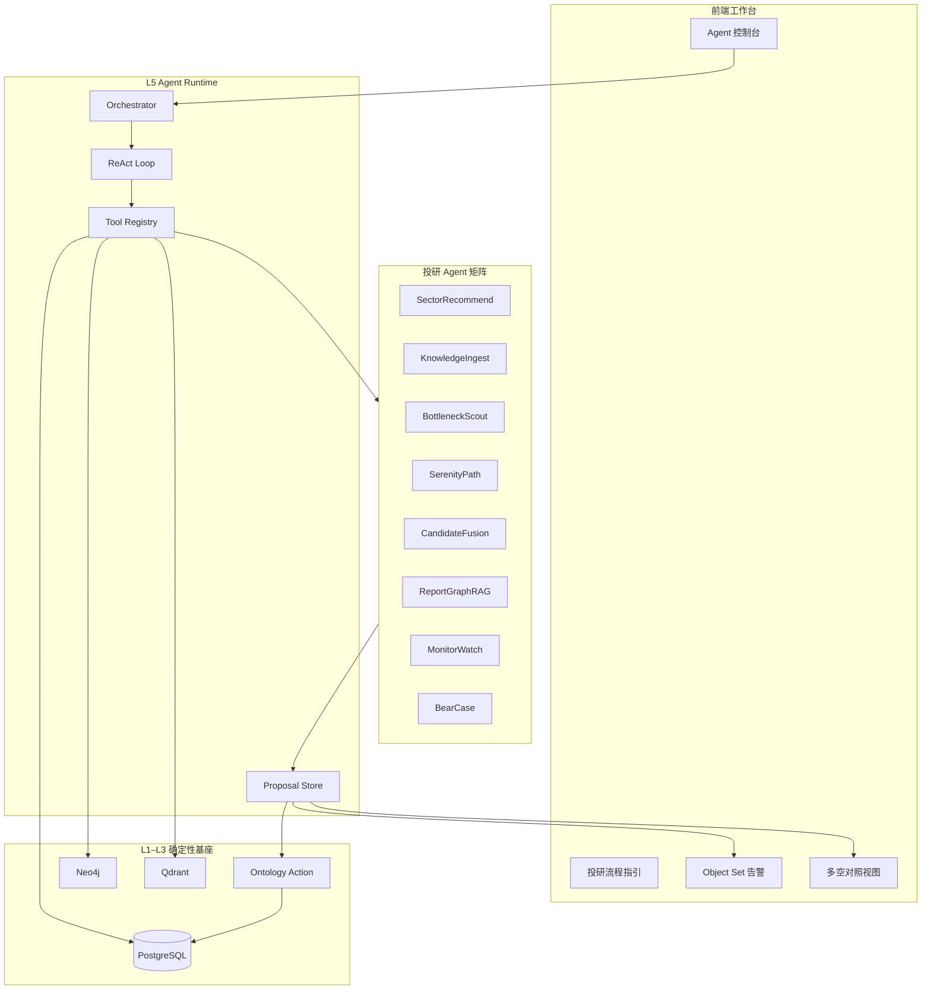
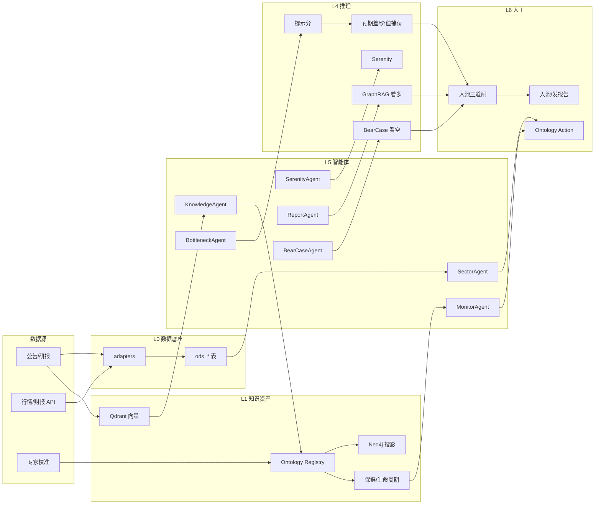
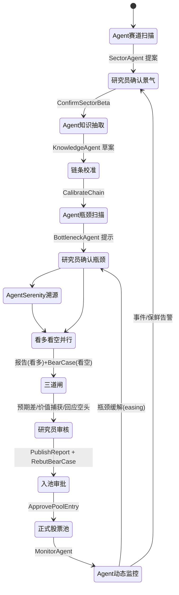
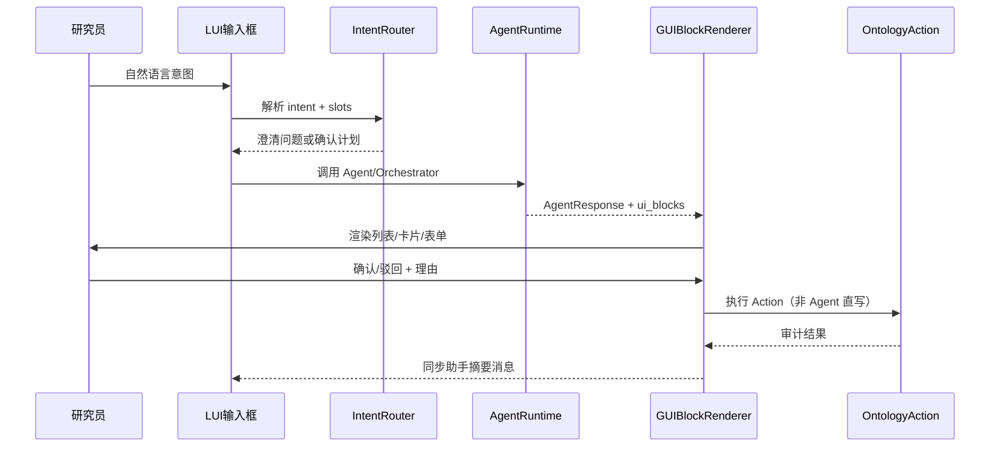

# 产业瓶颈 Alpha 智能选股系统 — 总体方案设计

> **文档版本**：v3.1
> **最后更新**：2026-06
> **文档性质**：本项目**唯一总方案**，整合各分册设计内容。
> **冲突处理**：本文档优先于其他历史材料；专题细节见 `docs/` 分册，冲突时以本文档为准。
> **v3.0 骨架变更**：在「Ontology + 知识图谱 + 多智能体 + 人机协同」之上，新增**三条贯穿主线**——**反证优先、知识保鲜、预期差与价值捕获**，并将其从下游步骤提升为设计主干。详见 §1.4、§2.6、§5.7、§6.3、§6.4、§11.1。
> **v3.1 交互变更**：Agent 运行采用 **LUI（意图对话）+ 动态 GUI Block（结果与确认）**，见 §8.6。

---

## 目录

1. [系统定位](#1-系统定位)
2. [双投研逻辑融合](#2-双投研逻辑融合)
3. [总体架构与智能体体系](#3-总体架构与智能体体系)
4. [数据底座](#4-数据底座)
5. [本体、知识资产与 Ontology 语义层](#5-本体知识资产与-ontology-语义层)
6. [推理引擎与算法](#6-推理引擎与算法)
7. [业务应用层](#7-业务应用层)
8. [人机协同与投研流程](#8-人机协同与投研流程)
10. [实施路径与实现状态](#10-实施路径与实现状态)
11. [评估与验证](#11-评估与验证)
12. [风险提示与合规](#12-风险提示与合规)
13. [附录](#13-附录)

---

## 1. 系统定位

### 1.1 一句话定位

**本系统是「AI Native 知识驱动定性投研操作系统（IR-OS）」**——以产业链知识图谱与 Palantir 式 Ontology 为**确定性基座**，以大模型与多智能体为**推理与编排引擎**，融合专业买方产业投研体系与 Serenity 逆向选股逻辑，辅助研究员完成赛道发现、瓶颈识别、标的筛选、**多空对抗论证**与动态跟踪。

> **量化打分仅作辅助排序与提示，不构成自动投资决策。智能体产出均为提案（Proposal），须经 Ontology Action 人工确认后方可生效。**
>
> **三句话纪律**：① 识别瓶颈 ≠ 存在超额，入池前必答**预期差**与**价值捕获**；② 任何看多结论必须同时给出**等强度看空论点**，未被回应不得入池；③ 任何结论都有**保鲜期**，过期自动降级，系统回答的是「现在还成立吗」而非「曾经成立」。

### 1.2 建设目标

- 产业链瓶颈挖掘与 Alpha 环节识别
- 可解释、可审计、**可被等强度反驳**的智能化投研
- 股票筛选、赛道研判、主升浪行情捕捉的**系统化技术支撑**

### 1.3 系统边界

#### 是什么

| 能力 | 说明 |
|------|------|
| 知识资产平台 | 产业链拓扑、瓶颈判定、证据链、专家校准记录、**知识保鲜状态** |
| 定性推理助手 | Beta 赛道识别、Alpha 环节锚定、逆向溯源、**多空对抗反证** |
| 预期差/价值捕获评估 | 市场一致预期 price-in 度量、瓶颈环节利润捕获能力研判 |
| 协作投研工作台 | 批注、复核、覆盖、投委会材料导出 |
| 智能体编排层 | 投研 Agent 矩阵 + ReAct 工具调用；机器扫描、起草、对抗、告警，人终审 |

#### 不是什么

| 类型 | 说明 |
|------|------|
| 量化交易系统 | 不做因子回测、不做自动下单、不以历史收益率为优化目标 |
| 黑盒荐股工具 | 所有结论必须附带证据链、推理路径与反证 |
| 全自动选股机 | 最终入池、仓位、买卖时点由人工研究员确认 |
| 行情预测系统 | 不承诺收益，不输出买卖时点信号 |

### 1.4 三条设计主线（v3.0 核心）

在五大技术支柱之上，贯穿全系统的三条方法论主线。它们不是某一层的局部功能，而是横切 L0–L6 的设计纪律——每一条都对应买方真正赚钱（或亏钱）的关键环节。

#### 主线一：反证优先（Adversarial-by-default）

多头逻辑与空头逻辑**等强对抗**。系统为每个候选标的同时生成「看多论点链」与「看空论点（Bear Case）」，由独立的 **BearCaseAgent** 自带证据检索、与看多论点**同等投入**地对打，产出结构化「关键假设 + 证伪条件（what would prove me wrong）」。

- 反证不再是报告生成的下游 checklist，而是**入池前的硬闸门**：高severity 空头论点未被研究员正面回应（rebuttal），不得进正式池。
- 详见 [§6.4 反证引擎与 BearCaseAgent](#64-反证引擎与-bearcaseagent)。

#### 主线二：知识保鲜（Freshness-aware）

产业链知识有**半衰期**。瓶颈、产能、CR4、扩产周期等每条 confirmed 知识携带 `valid_until` 与 `freshness` 状态；瓶颈本身建模为**一等生命周期对象**（`hint → confirmed → easing → expired`），到期自动降级并触发复核。

- 系统回答的不是「这曾是瓶颈」，而是「**这现在还是瓶颈吗**」。过期知识不参与提示分计算或显著降权。
- 详见 [§5.7 知识保鲜与瓶颈生命周期](#57-知识保鲜与瓶颈生命周期)。

#### 主线三：预期差与价值捕获（Edge & Value-capture）

**识别瓶颈 ≠ 存在超额收益**。入池前必须回答两个买方核心问题：

1. **预期差（Edge）**：市场一致预期已经 price in 了多少？（盈利预测修正方向与幅度、卖方评级分散度、北向/融资拥挤度趋势）
2. **价值捕获（Value Capture）**：瓶颈环节是否真能把稀缺性转化为利润？（议价权、客户集中度、定价机制——市场定价 vs 长协锁价）

两题不过关，瓶颈再硬也只是「**正确但不赚钱**」。详见 [§2.6 入池三道闸](#26-入池三道闸预期差--价值捕获--反证) 与 [§6.3 预期差与价值捕获算子](#63-预期差与价值捕获算子)。

### 1.5 核心能力分层（L0–L6）

```
┌─────────────────────────────────────────────────────────┐
│  L6 人工决策层    研究员终审 · 投委会 · 仓位与风控      │  ← 唯一决策权
├─────────────────────────────────────────────────────────┤
│  L5 智能体编排层  Agent 矩阵 · ReAct · Orchestrator     │  ← 任务编排与提案
├─────────────────────────────────────────────────────────┤
│  L4 定性推理层    GraphRAG · 多空对抗(Bear) · 情景分析   │  ← LLM + 图谱
├─────────────────────────────────────────────────────────┤
│  L3 知识推理层    Ontology Action · 图谱多跳 · CBR       │  ← 确定性推理
├─────────────────────────────────────────────────────────┤
│  L2 辅助量化层    瓶颈提示分 · 预期差信号 · 价值捕获      │  ← 仅排序提示
├─────────────────────────────────────────────────────────┤
│  L1 知识资产层    本体 · 图谱 · 向量 · 溯源 · 保鲜/生命周期│  ← 长期沉淀
├─────────────────────────────────────────────────────────┤
│  L0 数据底座层    ODS · 适配器 · Celery · MinIO          │  ← 真实世界接入
└─────────────────────────────────────────────────────────┘
```

**IR-OS 公式**：

```
IR-OS = Ontology（确定性基座）
      + Knowledge Graph（关系推理）
      + Vector RAG（证据检索）
      + Multi-Agent（任务编排）
      + Human-in-the-Loop（权责终审）

  ── 三条贯穿主线 ──
      反证优先 · 知识保鲜 · 预期差与价值捕获
```

**设计原则**：LLM/Agent 负责**感知、检索、综合、起草、对抗**；Ontology/图谱负责**约束、溯源、保鲜、执行**；人负责**确认、否决、担责**。

### 1.6 设计原则

1. **证据优先**：无证据不生成结论
2. **人机协同**：机器起草，人工定稿
3. **知识可沉淀**：每次人工修正必须回写知识库
4. **反证等强**：空头论点与多头论点同等投入，未被正面回应不得入池
5. **知识有时效**：每条结论标注保鲜状态，过期自动降级
6. **识别 ≠ 赚钱**：入池前必答预期差与价值捕获
7. **非量化优先**：新功能优先用图谱/本体/案例推理实现，再考虑辅助分数
8. **分数可校准**：提示分权重为带版本的可校准先验，由确认结果回流校准（见 §6.1）

### 1.7 系统输出物

| 输出物 | 性质 | 是否需人工确认 |
|--------|------|----------------|
| 产业链拓扑图 | 知识资产 | 新关系需专家校准 |
| 瓶颈提示分 | 辅助量化 | 否（需标注置信度 + 保鲜状态） |
| **知识保鲜状态** | 知识治理 | 过期自动降级，stale 需复核 |
| 候选标的池 | 辅助清单 | **是**，入池前必过三道闸 |
| **预期差评估（Edge）** | 定性推理 | 入池必答，high 标注预期透支 |
| **价值捕获判断** | 定性推理 | 入池必答，no/partial 降级 |
| **看空论点（Bear Case）** | 定性推理 | **是**，高severity 未回应阻断入池 |
| 投研逻辑草稿（看多） | 定性推理 | **是**，发布前必须审核 |
| 产业跟踪看板 | 数据展示 | 异常指标需人工研判 |

---

## 2. 双投研逻辑融合

### 2.1 两套核心逻辑

#### 专业买方逻辑

搭建全产业链拓扑结构、量化供需瓶颈、跟踪产业核心指标、锚定高壁垒 Alpha 环节，吃完整赛道主升浪行情。

- **推理方向**：自上而下（赛道 → 全链拓扑 → 瓶颈环节 → 龙头）
- **收益来源**：Beta 主升浪 + Alpha 壁垒溢价
- **标的偏好**：壁垒龙头、业绩兑现
- **持仓周期**：中长期（6–24 月）

#### Serenity 逆向选股逻辑

从终端高景气赛道逆向溯源上游、挖掘小众刚需咽喉环节、偏好低拥挤度中小市值标的、规避热门终端溢价泡沫。

- **推理方向**：自下而上（终端景气 → 向上 3–4 层 → 小众环节）
- **收益来源**：低估弹性、认知差修复
- **标的偏好**：中小市值、低拥挤、低覆盖
- **持仓周期**：中短期（3–12 月）

### 2.2 逻辑关系示意



### 2.3 买方逻辑 — 可执行标准

**赛道 Beta 识别（定性为主，需研究员确认）：**

- 下游需求复合增速 > 20%（数据提示）
- 行业资本开支同比为正
- 至少 2 份独立研报支持（证据引用）
- 系统打标 `beta_candidate` → 人工确认后 `beta_confirmed`

**瓶颈环节识别（规则提示 + 人工确认）：**

满足 ≥3 项则打 `bottleneck_hint`；人工确认后升为 `bottleneck_confirmed`：

| 条件 | 阈值 |
|------|------|
| 扩产周期 | > 18 个月 |
| 客户认证周期 | ≥ 2 年 |
| 行业 CR4 | > 60% |
| 海外设备/材料依赖 | 是 |
| 短期产能缺口 | 需求增速 > 产能增速 |
| 涨价持续性 | 连续 2 季度以上 |

> 瓶颈确认后进入**生命周期跟踪**（§5.7）：扩产落地、产能反超、涨价终止等事件会驱动 `confirmed → easing → expired`，不再是一锤定音的静态标签。

### 2.4 Serenity 逻辑 — 可执行标准

**输入**：共用 `beta_confirmed` 赛道库。

**逆向溯源**：从终端产品沿 `UPSTREAM_OF` 反向遍历 3–4 跳。

**小众咽喉环节（`serenity_niche`，满足 ≥4 项）：**

| 条件 | 阈值 |
|------|------|
| 产品层级 | 二级/三级耗材或材料 |
| 成本占比 | < 5% 但不可替代 |
| 替代难度 | 高 |
| 机构覆盖 | < 5 家 |
| 总市值 | < 200 亿（可配置） |
| 成交额分位 | < 30% |
| 终端龙头排除 | 非赛道市值前 3 |

> **结构性张力提示（A 股现实）**：Serenity 瞄准的「低覆盖、小市值、低成交」标的，恰恰是**数据最稀、流动性最差、信披质量最低**的群体——也是知识图谱最薄弱、最易幻觉的地带。因此 Serenity 池的每个标的：① `confidence` 默认降一档，强制双源；② 「替代难度高/不可替代」这类最难的定性判断**必须人工确认**，禁止 LLM 单独定性；③ 叠加 §2.6 三道闸时，价值捕获与流动性风险权重上调。详见 [§4.4 A 股特有问题](#44-a-股特有问题)。

### 2.5 三种融合模式

| 模式 | 路径 | 输出池 | 适用场景 |
|------|------|--------|---------|
| A 买方专业 | Beta → 拓扑 → 瓶颈确认 → 龙头 | `pool_buy_side` | 稳健主升 |
| B Serenity 逆向 | 终端 → 逆向溯源 → 小众筛选 | `pool_serenity` | 低估弹性 |
| C 双逻辑融合 | 两池并集 / 交集 / 互补 | `pool_fusion` | 高确定性 + 高弹性 |

**融合优先级：**

| 优先级 | 条件 | 含义 |
|--------|------|------|
| P0 | 同一公司同时出现在买方池与 Serenity 池 | 双逻辑共振 |
| P1 | 同赛道龙头 + 小众配套 | 组合建议草稿 |
| P2 | 仅满足单一逻辑 | 普通候选 |

> 系统生成「核心 + 弹性」组合建议，**不自动分配仓位**。共振只是排序提示，仍须逐一通过 §2.6 三道闸。

### 2.6 入池三道闸（预期差 · 价值捕获 · 反证）

> **v3.0 新增核心闸门。** 任何候选标的在 `ApprovePoolEntry`（入正式池）之前，必须依次通过三道闸；每道闸产出结构化结论并挂载到 `CandidatePoolEntry`，在入池确认页强制展示。三道闸把「识别 ≠ 赚钱」「反证等强」两条纪律落成流程硬约束。



**闸一 · 预期差（Edge）** — 由 `edge_signal` Function 产出（§6.3）

| 信号 | 数据来源 | 含义 |
|------|---------|------|
| 一致预期 EPS 修正趋势 | 研报库/数据商 | 上修=预期未满，下修=兑现/恶化 |
| 卖方评级分散度 | 研报库 | 分散=认知差，一致看多=拥挤 |
| 北向/融资/成交额分位趋势 | 行情 ODS | 拥挤度趋势 |

输出 `edge_assessment = { priced_in: low|medium|high, evidence_refs }`。`high` → 标注「预期透支」，降级但不强制剔除（人工可保留并自述理由）。

**闸二 · 价值捕获（Value Capture）** — 由 `value_capture` Function 产出（§6.3）

| 信号 | 数据来源 | 含义 |
|------|---------|------|
| 毛利率趋势 / 预收 / 合同负债 | 财报 | 议价权 |
| 前五大客户集中度 | 财报 | 高集中 → 议价权旁落 |
| 定价机制 | 公告/研报/专家 | 市场定价（弹性）vs 长协锁价（无弹性） |

输出 `value_capture = { captures_economics: yes|partial|no, evidence_refs }`。瓶颈真实但 `no/partial`（利润被下游大客户攫取或合约锁死）→ 降级或标注「瓶颈正确但利润不在此环节」。

**闸三 · 反证（Bear Case）** — 由 BearCaseAgent 产出（§6.4）

- 空头论点与看多逻辑链**等强度**并排展示；
- `severity=high` 的空头论点**未被研究员正面回应（rebuttal 必填）→ 阻断 `ApprovePoolEntry`**；
- 这是流程硬约束，区别于旧版「反证仅生成告警、不阻断」。

---

## 3. 总体架构与智能体体系

> **智能体编排应嵌入各层，而非孤立成章。** L5 是 Agent 运行时与 Orchestrator 的「主场」；各 Agent 通过 Tool Registry 调用下层能力，产出提案后由 L6 人工 Action 生效。
>
> **v3.0 编排取向**：明确区分**真 LLM 智能体**（抽取、多空叙事综合——LLM 不可替代）与**确定性 Pipeline**（提示分扫描、图遍历、集合运算——规则即可，LLM 仅做兜底/解释）。ReAct 循环只用于前者，避免对确定性任务套 LLM 外壳带来的延迟、成本与不可解释性。详见 §3.4。

### 3.1 架构总览

系统采用 **能力分层（L0–L6）** 与 **技术组件** 正交映射：

```
┌──────────────────────────────────────────────────────────────────┐
│  前端交互层    React · G6 · 看板 · **LUI 对话 + 动态 GUI Block** · 多空对照 │
├──────────────────────────────────────────────────────────────────┤
│  L6 人工决策   ConfirmSectorBeta · ApprovePoolEntry · 三道闸 · 双人复核 │
├──────────────────────────────────────────────────────────────────┤
│  L5 智能体编排  Agent 矩阵 · ReAct · Orchestrator · Object Set 告警 │
├──────────────────────────────────────────────────────────────────┤
│  L4 定性推理   GraphRAG(看多) · BearCase(看空) · 报告生成          │
├──────────────────────────────────────────────────────────────────┤
│  L3 知识推理   Ontology Function · 图谱多跳 · CBR · 生命周期状态机   │
├──────────────────────────────────────────────────────────────────┤
│  L2 辅助量化   瓶颈提示分 · Serenity 算子 · 预期差 · 价值捕获        │
├──────────────────────────────────────────────────────────────────┤
│  L1 知识资产   OWL · Ontology Registry · Neo4j · Qdrant · 溯源/保鲜  │
├──────────────────────────────────────────────────────────────────┤
│  L0 数据底座   ODS · adapters · Celery · MinIO · 清洗流水线          │
├──────────────────────────────────────────────────────────────────┤
│  基础平台      PostgreSQL · Neo4j · Qdrant · Redis · LLM API        │
└──────────────────────────────────────────────────────────────────┘
```

### 3.2 分层职责与智能体映射

各层既有**确定性能力**（Function / Pipeline），也有**智能体驻留点**（Agent 通过工具调用该层，或在该层产出提案）：

| 层级 | 核心职责 | 关键组件 | 驻留/关联 Agent | 产出与确认 |
|------|---------|---------|----------------|-----------|
| **L0 数据底座** | 外部数据接入、ODS 入库、定时同步 | `adapters/`、`ods_*` 表、Celery Beat | **MonitorWatchAgent**（指标/公告异动 + 保鲜到期扫描） | 告警 → 人工复核 |
| **L1 知识资产** | 本体、图谱、向量、溯源、**保鲜/生命周期** | OWL、Registry、Neo4j、Qdrant、MinIO | **KnowledgeIngestAgent**（文档解析与抽取） | `KnowledgeDraft` → `CalibrateChain` |
| **L2 辅助量化** | 透明规则打分、排序提示、预期差/价值捕获 | `hint_score.py`、`serenity_trace.py`、`edge_signal`、`value_capture` | **BottleneckScoutAgent**、**SerenityPathAgent** | 提示列表 → `ConfirmBottleneck` / `ConfirmSerenityNiche` |
| **L3 知识推理** | 确定性 Function、Object Set、Action 引擎、生命周期状态机 | `action_executor`、`function_runtime` | 各 Agent 通过 Tool 调用 Function | Action 写回 `ont_*` + 审计 |
| **L4 定性推理** | GraphRAG（看多）、**BearCase（看空对抗）**、报告 | `graphrag.py`、`bearcase.py`、`report.py` | **ReportGraphRAGAgent**、**BearCaseAgent** | `ResearchReport(draft)` + `BearCase` → `PublishReport` |
| **L5 智能体编排** | ReAct 运行时、提案存储、任务串联 | `agents/`、Tool Registry、Orchestrator | **SectorRecommendAgent**、**CandidateFusionAgent**、Orchestrator | `SectorRecommendation` 等 → 各 Action |
| **L6 人工决策** | 终审、否决、担责 | 前端确认页、三道闸、审计日志 | —（人执行 Action，Agent 不可越权） | 正式池 / 已发布报告 |

**编排原则**：

1. Agent **不能直接** `UPDATE` 权威 Ontology 对象；只能写 `proposed` / `draft` 提案表
2. 每条提案必须带 `evidence_refs`、`agent_mode`、`run_id`
3. LLM 不可用时走**规则降级路径**，系统仍可运行
4. 所有 Agent 共享 **Tool Registry**，避免重复封装
5. **看多与看空相互独立检索**：BearCaseAgent 不复用看多 Agent 的检索结果，独立找反面证据，避免确认偏误

### 3.3 智能体运行时



#### ReAct 循环规范（仅用于 A 类真 LLM 智能体）

```
1. 初始化：注入 focus/query、可用工具列表 TOOL_SPECS
2. 循环（最多 N=5 轮）：
   a. LLM 输出 JSON：{ thought, action, action_input } 或 { thought, final_answer }
   b. 若 action → execute_tool() → 观察结果追加到 messages
   c. 若 final_answer → 校验 JSON schema → 落库
3. 降级：LLM 失败 → 规则扫描（指标+关键词+观察清单）
4. 后置：save_proposals() + push_object_set_alerts()
```

#### 共享 Tool Registry（`backend/app/agents/`）

| 工具名 | 所属层 | 说明 |
|--------|--------|------|
| `list_sectors` | L3 | 已有赛道及确认状态 |
| `collect_metrics_signals` | L0/L2 | 产业指标信号（读 ODS） |
| `search_research_evidence` | L1 | 种子证据 + 上传研报混合检索 |
| `extract_sector_themes_from_reports` | L1 | 从研报抽取赛道主题 |
| `calcBottleneckHint` | L2 | 瓶颈提示分 Function |
| `serenityReverseTrace` | L2 | 逆向溯源 Function |
| `edgeSignal` / `valueCapture` | L2 | 预期差 / 价值捕获 Function |
| `buildFusionPool` | L2/L3 | 双逻辑候选池 |
| `search_hybrid` / `generateReportDraft` | L4 | GraphRAG 检索与草稿 |
| `searchCounterEvidence` / `generateBearCase` | L4 | 独立反证检索与看空草稿 |

#### InvestResearchOrchestrator（✅ v1）

按投研流程串联 Agent，支持门控检查（`require_sector_confirmed` 等）、「一键投研」与断点续跑。

- API：`POST /api/v1/agents/orchestrator/run`
- 门控步骤：`bottleneck_scout`、`serenity_path`、`report_graphrag`、`bear_case`、`candidate_fusion` 需赛道已确认

### 3.4 投研智能体矩阵

> **v3.0 重构**：不再笼统称「七大 Agent」，而是按「LLM 是否不可替代」分为两类。这直接回答了「多智能体是否过度工程」的质疑——**LLM 真正不可替代的只有非结构化抽取与多空叙事综合**，其余应是透明、确定、可审计的 Pipeline。

#### A 类 · 真 LLM 智能体（ReAct，LLM 不可替代）

| Agent | 投研步骤 | 使命 | 提案对象 | 人工 Action |
|-------|---------|------|---------|------------|
| **KnowledgeIngestAgent** | 拓扑构建 | 解析 PDF/公告，抽取三元组，索引向量 | `KnowledgeDraft` | `CalibrateChain` |
| **ReportGraphRAGAgent** | 看多论证 | 三级 GraphRAG 生成看多逻辑链 | `ResearchReport(draft)` | `PublishReport` |
| **BearCaseAgent** 🆕 | 看空对抗 | 独立检索反面证据，生成等强度空头论点 | `BearCase` | 研究员 rebuttal（入池闸三） |

#### B 类 · 确定性 Pipeline（规则为主，LLM 仅兜底/解释）

| Agent/Pipeline | 投研步骤 | 本质 | 提案对象 | 人工 Action |
|-------|---------|------|---------|------------|
| **SectorRecommendAgent** | 赛道发现 | 信号扫描 + 主题抽取（LLM 增强排序与措辞） | `SectorRecommendation` | `ConfirmSectorBeta` |
| **BottleneckScoutAgent** | 瓶颈扫描 | 提示分规则引擎扫描 | `BottleneckRecommendation` | `ConfirmBottleneck` |
| **SerenityPathAgent** | 逆向溯源 | 图遍历 + 剪枝（确定性算法） | 路径 + niche 建议 | `ConfirmSerenityNiche` |
| **CandidateFusionAgent** | 候选融合 | 集合运算 + 可解释排序 | 排序说明 | `ApprovePoolEntry` |
| **MonitorWatchAgent** | 动态监控 | 规则告警 + **保鲜/生命周期状态机驱动** | `Alert` | 路由至对应 Action |

> 命名说明：B 类沿用 "Agent" 仅为前端一致性，实现上应优先是确定性 Pipeline；只有当规则确实无法表达（如自然语言主题归并）时才引入 LLM，并标注 `llm_assisted=true`。

**Agent 边界（不可违反）**：

| 允许 | 禁止 |
|------|------|
| 推荐赛道、起草报告、排序候选、生成看空论点 | 自动入池、自动发布报告 |
| LLM 综合多源证据生成论述 | 无 citation 的结论写入 Ontology |
| 规则+LLM 双模降级 | 编造产能、财报、关系数据 |
| 告警催促人工处理 | 替代研究员承担投研责任、替研究员回应空头论点 |

### 3.5 Object Set 与告警

**Registry 对象集**（`ontology/registry/object_sets.yaml`）：

| Object Set | 用途 |
|------------|------|
| `BetaConfirmedSectors` | 已确认景气赛道 |
| `BottleneckProducts` | 瓶颈提示/已确认产品 |
| `StaleKnowledge` 🆕 | 保鲜过期、待复核知识 |
| `EasingBottlenecks` 🆕 | 进入「缓解中」的瓶颈 |
| `PendingCandidates` | 待入池候选 |
| `UnrebuttedBearCases` 🆕 | 高severity 空头论点未回应 |
| `P0FusionCandidates` | 双逻辑 P0 共振 |
| `ProposedSectorRecommendations` | 待采纳赛道提案 |

**告警类型**：

| type | level | 触发来源 |
|------|-------|---------|
| `sector_not_confirmed` | high | 工作流门控 |
| `sector_recommend_proposed` | high | SectorRecommendAgent |
| `bottleneck_hint_unconfirmed` | medium | BottleneckScout / Object Set |
| `knowledge_stale` 🆕 | medium | 保鲜状态机 / MonitorWatch |
| `bottleneck_easing` 🆕 | high | 生命周期状态机（扩产/降价事件） |
| `bear_case_unrebutted` 🆕 | high | BearCaseAgent / 入池闸三 |
| `pending_candidates` | medium | 候选池 |
| `p0_resonance` | info | 双逻辑共振 |

### 3.6 端到端数据流



---

## 4. 数据底座

### 4.1 数据分层

```
L3  应用数据    候选池、报告、批注、审计日志
L2  知识数据    图谱、本体、向量索引、溯源、保鲜状态
L1  清洗数据    标准化财报、公告、行业指标
L0  原始数据    PDF、API 原始响应 → ODS 表
```

### 4.2 数据源规划（已落地全景）

> 原 Wind/iFinD 付费源已**全部移除**，改用「免费源 + Tushare Pro 积分」组合，按数据类型拆分适配器；
> 所有外部数据**先入 ODS，业务侧只读 ODS**，遵循「宁缺数据，不可编造」。

| 类别 | 适配器（kind/name） | 真实数据源 | 获取方式 | 费用 | 频率 | ODS 表 |
|------|--------------------|-----------|---------|------|------|--------|
| 行情（收盘/市值/PE 分位） | `market/auto` | Tushare Pro（主）+ AkShare 东财（备） | `pro.daily`+`pro.daily_basic` / `stock_individual_info_em`+`stock_a_lg_indicator` | Tushare 2000 积分 | 日 | `ods_market_daily` |
| 公告 | `announcement/akshare` | 巨潮资讯 cninfo | `stock_zh_a_disclosure_report_cninfo` + 标题关键词分类 | 免费 | 实时/日 | `ods_announcement` |
| 研报（元数据） | `research/em` | 东方财富 | `stock_research_report_em`（标题/机构/评级/日期） | 免费 | 日 | `ods_external_report` |
| 财报（营收/净利/毛利率/ROE/EPS） | `financial/tushare` | Tushare Pro | `pro.income` + `pro.fina_indicator` | 2000 积分 | 季 | `ods_financial_statement` |
| 材料行情（大宗商品） | `metrics/akshare` | 期货主力连续 | `futures_main_sina` → 现价 + 同比；映射见 `data/material_contracts.json` | 免费 | 日 | `ods_industry_metric` |
| 产业软指标（产能利用率/扩产周期/出货同比） | 研报抽取桥接 | em 研报标题 → 知识抽取 | `report_ingest_bridge` → 草案 → 人工 confirm | 免费 | 事件驱动 | `ont_knowledge_draft` → 图谱 |
| 内部研报 PDF | 上传 | 用户上传 | 前端上传 → 解析 | — | 日 | `ods_research_report` |
| 一致预期/评级分散度 | ⬜ 规划 | 研报库聚合 | — | — | 日/周 | `ods_consensus` 🆕 |

**关于赛道与材料映射**：系统目标是**智能体自动推荐热门赛道**（SectorRecommendAgent 扫描动态观察清单产出 beta 提案），种子里的 `sector_ai_compute` 等仅是示例。`material_contracts.json` 因此按「被推荐/确认的赛道」动态扩展——新赛道确认后补一条 `sector_id → {材料: 合约}` 映射即可接入材料行情，无需改代码。AI 算力上游材料（磷化铟、光芯片等）无公开期货，对应条目留空，材料软指标走研报抽取闭环。

### 4.3 ODS 表与适配器

| 表 | 用途 | 状态 |
|----|------|------|
| `ods_market_daily` | 日度行情（收盘/市值/PE 分位） | ✅ `auto`(tushare→akshare) 真实源 |
| `ods_announcement` | 公告元数据（含分类/链接） | ✅ `akshare` 巨潮真实源 |
| `ods_external_report` 🆕 | 外部研报元数据（机构/评级） | ✅ `em` 东财真实源 |
| `ods_financial_statement` 🆕 | 财报关键科目时序 | ✅ `tushare` 真实源（需积分） |
| `ods_industry_metric` | 产业指标 / 材料行情时序 | ✅ `akshare` 期货材料 + mock 兜底 |
| `ods_research_report` | 内部研报元数据 | ✅ 上传时写入 |
| `ods_consensus` 🆕 | 一致预期/评级分散度 | ⬜ 规划（支撑预期差） |

**接入架构**：

```
外部 API/文件 → adapters/{market,announcement,research,financial,metrics}/
    → PostgreSQL(ODS) + MinIO → Celery 清洗 → 标准层
    → 知识抽取/图谱同步 → Agent 工具只读 ODS
```

**适配器分层**：`backend/app/adapters/` 按数据类型拆分子包，每类含 `mock`（演示）+ 真实源；
通过 `DATA_ADAPTER_MARKET/ANNOUNCEMENT/METRICS/FINANCIAL/RESEARCH` 环境变量切换，默认 `mock`，生产切真实源。

**同步 / 抽取 API**：

- `GET /api/v1/data/adapters` ｜ `GET /api/v1/data/ods/stats`
- `POST /api/v1/data/sync/metrics/{sector_id}`（材料行情）
- `POST /api/v1/data/sync/market/{sector_id}`（行情）
- `POST /api/v1/data/sync/announcements/{sector_id}`（公告）
- `POST /api/v1/data/sync/financials/{sector_id}`（财报）
- `POST /api/v1/data/sync/reports/{sector_id}`（研报元数据）
- `POST /api/v1/data/reports/{sector_id}/ingest`（研报标题 → 知识草案，产能/扩产瓶颈信号）

Celery Beat：`data.sync_industry_metrics` 日更指标；`data.sync_sector_bundle` 一次性同步行情/公告/财报/研报。

### 4.4 A 股特有问题

| 问题 | 策略 |
|------|------|
| ST / *ST | 候选池默认排除 |
| 借壳/重组 | 标记 data_quality_warning |
| 关联交易 | 供应链关系需人工确认 |
| 拥挤度 | 北向/融资/成交额分位辅助 |
| **题材/游资反身性** 🆕 | 瓶颈真实但股价已脱离基本面（如已 +200% 题材炒作）→ 预期差闸标注「预期透支」，与基本面瓶颈分离展示 |
| **研报叙事自反性** 🆕 | 研报在制造它所描述的一致预期；多份同源研报不计为多源（见 §5.8），关键关系须硬源交叉 |
| **解禁/减持** 🆕 | 作为事件 `TRIGGERS` 纳入监控，影响价值捕获与时点风险 |
| **小市值数据稀疏** 🆕 | Serenity 标的 confidence 降档、强制双源、关键定性人工确认（见 §2.4） |

### 4.5 缺失降级原则

> **宁可缺数据，不可编造数据。**

| 缺失 | 降级 |
|------|------|
| 产能 | 该项不计分，标注缺失 |
| 上下游关系 | 不进 Serenity 路径 |
| 一致预期 | 预期差闸标注「无法评估 price-in」，不放行高优先级 |
| 研报 | 报告标注「证据不足」 |

---

## 5. 本体、知识资产与 Ontology 语义层

> 完整 Ontology 实现见 [11-palantir-ontology.md](./11-palantir-ontology.md)；注册表见 `ontology/registry/`。

### 5.1 核心实体

#### 产品节点（产业链拓扑核心）

| 属性类别 | 字段 |
|---------|------|
| 基础 | 产品ID、名称、所属赛道、层级（终端/中游/材料/耗材） |
| 产业 | 成本占比、扩产周期、技术壁垒等级、替代难度、认证周期 |
| 格局 | 全球产能、CR4集中度、海外依赖度 |
| 标签 | 瓶颈状态、Serenity小众标签、提示分 |
| 动态 | 产能增速、需求复合增速、供需缺口系数、涨价周期 |
| **保鲜** 🆕 | valid_until、freshness、last_verified_at、half_life_days |

#### 上市公司 / 赛道 / 产业事件

见字段规范速查（产品、公司节点完整字段列表保留于分册）。公司节点补充**价值捕获**相关字段：毛利率趋势、前五大客户集中度、合同负债、定价机制标签。

### 5.2 核心拓扑关系

| 关系 | 语义 |
|------|------|
| UPSTREAM_OF | 产品 → 产品（上游原材料） |
| PRODUCES | 公司 → 产品（主营生产） |
| BELONGS_TO | 产品 → 赛道 |
| TRIGGERS | 事件 → 产品（事件驱动，含扩产/降价/解禁） |

### 5.3 Palantir Ontology 五元组

```
Object Type  —  业务对象（Product, Company, Sector, BearCase…）
Link Type    —  对象关系（upstream_of, produces…）
Function     —  派生计算（提示分、逆向溯源、预期差、价值捕获、候选池）
Action Type  —  业务操作（确认瓶颈、入池、发报告、确认缓解）
Object Set   —  预定义对象集合查询
```

**存储职责**：

| 存储 | 职责 |
|------|------|
| PostgreSQL `ont_*` | Object/Link 权威数据、Agent 提案表 |
| PostgreSQL `knowledge_*` | 证据溯源、保鲜元数据 |
| Neo4j | 多跳遍历、G6 可视化（异步投影） |
| `ontology/registry/*.yaml` | 语义定义（Git 版本化） |

**核心原则**：PostgreSQL 为 Ontology 权威存储，Neo4j 为图投影；入池/瓶颈确认等流程统一建模为 **Action**，自动审计与写回。

### 5.4 Object Type 与 Agent 映射

| Object Type | 关键属性 | 关联 Agent |
|-------------|---------|-----------|
| Product | bottleneck_status, serenity_niche, freshness | BottleneckScout, SerenityPath |
| Sector | status, demand_growth_hint | SectorRecommend |
| CandidatePoolEntry | mode, priority, status, edge_assessment, value_capture | CandidateFusion |
| ResearchReport | logic_chain, status | ReportGraphRAG |
| **BearCase** 🆕 | risk, severity, probability, rebuttal_status | BearCaseAgent |
| KnowledgeAssertion | property, value, provenance, valid_until | KnowledgeIngest |
| SectorRecommendation | beta_score, status, agent_mode | SectorRecommend |

### 5.5 Action 与 Function 映射

| 人工确认节点 | Action Type |
|-------------|-------------|
| 赛道景气确认 | `ConfirmSectorBeta` |
| 产业链链条校准 | `CalibrateChain` |
| 瓶颈标签确认 | `ConfirmBottleneck` |
| **瓶颈缓解/失效确认** 🆕 | `ConfirmBottleneckEasing` |
| Serenity 小众确认 | `ConfirmSerenityNiche` |
| 候选入池 / 否决 | `ApprovePoolEntry` / `RejectPoolEntry` |
| **空头论点回应** 🆕 | `RebutBearCase` |
| 报告发布 | `PublishReport` |

| Function | 模块 | 调用 Agent |
|----------|------|-----------|
| `calcBottleneckHint` | hint_score.py | BottleneckScout |
| `serenityReverseTrace` | serenity_trace.py | SerenityPath |
| `edgeSignal` 🆕 | edge_signal.py | CandidateFusion（闸一） |
| `valueCapture` 🆕 | value_capture.py | CandidateFusion（闸二） |
| `generateBearCase` 🆕 | bearcase.py | BearCaseAgent（闸三） |
| `buildFusionPool` | candidate_pool.py | CandidateFusion |
| `generateReportDraft` | report.py | ReportGraphRAG |

### 5.6 知识工程

**生命周期**：获取 → 表示 → 融合 → 推理 → 演化 → 评估（人工校准闭环）。

**知识元数据（每条必带）**：`knowledge_id`、`entity_type`、`entity_id`、`property`、`value`、`confidence`、`source_type`、`source_ref`、`status`、`ontology_version`、`valid_until`、`freshness`。

**溯源原则**：draft → confirmed 必须可追溯；人工覆盖留痕并回写。

**冲突消解**：双源不一致 → 标记 conflict → 人工仲裁 → 胜者 confirmed。

**质量 KPI（一期目标）**：三元组准确率 ≥ 85%、链条完整度 ≥ 80%、溯源覆盖率 100%（confirmed 知识）、**保鲜达标率 ≥ 90%（confirmed 知识未过 valid_until）**。

**CBR 案例库**：光伏硅料、光模块/AI算力、锂电隔膜等历史复盘，GraphRAG 检索辅助定性判断；并作为**结果回溯**的学习信号（见 §11.1）。

### 5.7 知识保鲜与瓶颈生命周期

> **v3.0 新增（主线二落地）。** 解决「瓶颈半年前成立、现在可能已缓解」的命门问题。

#### 保鲜状态机（每条 confirmed 知识）

```
fresh ──(超过 half_life)──▶ aging ──(超过 valid_until)──▶ stale
  ▲                                                          │
  └──────────────── 人工/数据复核刷新 ◀──────────────────────┘
```

- 字段：`half_life_days`（按属性类型配置）、`valid_until = last_verified_at + half_life`、`freshness ∈ {fresh, aging, stale}`
- `stale` 知识：**不参与提示分计算或显著降权**，前端显式标注「数据可能过期」，进入 `StaleKnowledge` Object Set 与 `knowledge_stale` 告警

**半衰期参考表（可配置）**：

| 属性类型 | half_life 参考 |
|---------|---------------|
| 产能 / 供需缺口 / 涨价 | ~90 天 |
| CR4 / 竞争格局 / 机构覆盖 | ~180 天 |
| 扩产周期 / 认证周期 | ~365 天 |
| 上下游关系结构 | ~720 天 |

#### 瓶颈生命周期（一等对象状态机）

```
none → bottleneck_hint → bottleneck_confirmed → bottleneck_easing(缓解中) → bottleneck_expired(失效)
                                    ▲                      │
                                    └──── 重新收紧 ◀───────┘
```

- 转移触发（由 MonitorWatchAgent 监听 `TRIGGERS` 事件提议，人工确认）：
  - → `easing`：扩产落地公告、产能增速反超需求、涨价终止、认证放开
  - → `expired`：缓解持续 + 提示分跌破阈值
- `ConfirmBottleneckEasing` Action 留痕；`easing/expired` 的瓶颈不再支撑买方池入池逻辑，相关候选触发复核
- 进入 `EasingBottlenecks` Object Set 与 `bottleneck_easing`（high）告警

### 5.8 多源交叉与卖方去偏

> **v3.0 新增（P1-5）。** 防止用研报当上下游关系 ground truth 而整体导入卖方 groupthink。

**来源优先级与权重**（置信度 = 来源权重 × 抽取置信度）：

```
专家确认(1.0) > 公司公告/招股书(1.0) > 行业协会/海关(0.9)
  > 头部券商深度研报(0.85) > 其他研报(0.7) > LLM 抽取(0.4，默认进审核队列)
```

**去偏规则**：

1. **单一研报不得单独将关系升为 `confirmed`**——需 ≥2 独立来源，或 1 个硬源（公告/招股书/海关）交叉
2. **自反性叙事打标**：当某关系/瓶颈判断仅来自卖方研报，且多份研报实为同源观点扩散（同一卖方/同一首发观点），标记 `reflexive_narrative=true`，降权并要求硬源验证
3. **同源不计为多源**：多份转述同一首发观点的研报，去重后视为单源

---

## 6. 推理引擎与算法

### 6.1 瓶颈提示分规则引擎

> 使用透明可审计的规则引擎，输出「瓶颈提示分（Hint Score）」，**非 GNN 黑盒**。

```
bottleneck_hint_score =
    supply_rigidity   × w1
  + tech_barrier      × w2
  + supply_demand_gap × w3
  + concentration     × w4
（初始先验 w = 0.30 / 0.25 / 0.25 / 0.20）
```

| 分数 | 标签 | 系统动作 |
|------|------|---------|
| ≥ 70 | hint_high | 推荐复核，可申请 bottleneck_confirmed |
| 50–69 | hint_medium | 列入观察 |
| 30–49 | hint_low | 仅展示 |
| < 30 | — | 不标注 |

Score Card 必须含 `weight_breakdown`、`evidence_refs`、`disclaimer`、`weight_version`、`freshness`；禁止裸分数。

#### 提示分校准闭环（v3.0 新增）

> 解决「权重凭什么是 0.30 不是 0.25」的伪精确问题。权重不是写死常数，而是**带版本的可校准先验**。

```
ConfirmBottleneck / RejectBottleneck / ConfirmBottleneckEasing
   └─记录─▶ (hint_score, 人工裁决, 事后是否兑现) → outcome 表
              └─周期校准─▶ 各分档命中率 = 确认且事后兑现 / 总数
                            └─回流─▶ 调整 w1..w4 与阈值（新 weight_version，留痕）
```

- 样本不足（< N 个确认样本）时：前端标注「权重未校准（初始先验）」，提醒研究员谨慎采信
- 校准只调权重与阈值，**不引入黑盒**；每个 weight_version 可回溯、可回滚

### 6.2 Serenity 逆向溯源算子

**输入**：`beta_confirmed` 赛道 + 终端产品列表。

**算法**：从终端沿 `UPSTREAM_OF` 反向 DFS/BFS，深度 3–4 跳；产品层与公司层剪枝（见 §2.4）。

```
serenity_hint =
    niche_fit       × 0.30
  + supply_rigidity × 0.25
  + low_attention   × 0.25
  + path_quality    × 0.20
```

> 同样纳入 §6.1 的校准闭环；「不可替代/替代难度高」项**禁止 LLM 单独定性**，须人工确认（§2.4）。

### 6.3 预期差与价值捕获算子

> **v3.0 新增（主线三落地）。** 入池三道闸的前两道（§2.6）的计算后端，输出结构化、可溯源、缺失即降级的评估。

**`edgeSignal`（闸一 · 预期差）**

```
输入：stock_code
输出：{
  priced_in: low | medium | high,
  eps_revision_trend: up | flat | down,     // 一致预期 EPS 修正
  rating_dispersion: float,                  // 卖方评级分散度
  crowding_percentile: float,                // 北向/融资/成交额分位
  evidence_refs: [...]
}
```

`priced_in=high`（一致看多 + 拥挤 + 持续上修后兑现）→ 闸一标注「预期透支」。

**`valueCapture`（闸二 · 价值捕获）**

```
输入：product_id, company_code
输出：{
  captures_economics: yes | partial | no,
  gross_margin_trend: up | flat | down,
  customer_concentration: float,             // 前五大客户占比
  pricing_mechanism: market | contract,      // 市场定价 vs 长协锁价
  evidence_refs: [...]
}
```

`no/partial`（议价权弱 / 客户高度集中 / 长协锁死涨价弹性）→ 闸二降级或标注「瓶颈正确但利润不在此环节」。

> 数据缺失时显式降级（宁缺勿造），不得用 LLM 猜测填充。

### 6.4 反证引擎与 BearCaseAgent

> **v3.0 新增（主线一落地，原 §6.3 Level 2 反证升格为独立一等环节）。** 把「反证等强」从一句口号变成有独立 Agent、独立检索、硬闸门的工程实现。

**BearCaseAgent 特征**：

- **独立检索**：不复用看多 Agent 的检索结果，用 `searchCounterEvidence` 主动找反面证据，规避确认偏误
- **七项反证维度**（保留原 checklist，逐项必查）：

| 维度 | 数据来源 | 触发条件 |
|------|---------|---------|
| 技术替代 | 研报、专利、新闻 | 存在成熟替代方案 |
| 新增扩产 | 公告、产业链新闻 | 2 年内大量产能释放（联动 §5.7 easing） |
| 需求下滑 | 行业数据、下游出货 | 增速环比转负 |
| 估值透支 | PE/PB 分位、目标价 | 分位 > 80%（联动闸一） |
| 政策风险 | 政策库 | 限制性政策 |
| 客户集中度 | 财报 | 前五大客户 > 70%（联动闸二） |
| 库存累积 | 行业数据 | 库存周转恶化 |

**结构化输出（`BearCase` 对象）**：

```json
{
  "candidate_id": "...",
  "arguments": [
    {
      "risk": "台积电扩产 CoWoS 产能",
      "dimension": "新增扩产",
      "severity": "high",
      "probability": "medium",
      "evidence_refs": ["prov_004"],
      "what_would_confirm": "2026 H2 月产能爬坡公告 + 现货价格回落",
      "rebuttal_status": "unrebutted"
    }
  ]
}
```

**硬闸门（入池闸三）**：

- 看多逻辑链与看空论点**并排等强展示**（前端多空对照视图）
- `severity=high` 的空头论点 `rebuttal_status=unrebutted` → **阻断 `ApprovePoolEntry`**
- 研究员通过 `RebutBearCase`（填写正面回应，必填）方可放行；保留人工最终权，但「未回应不得入池」是流程硬约束
- 进入 `UnrebuttedBearCases` Object Set 与 `bear_case_unrebutted`（high）告警

### 6.5 GraphRAG 可解释推理（看多综合）

**三级推理**（看多侧；看空侧由 §6.4 承担）：

```
Level 3  逻辑生成   赛道Beta + 瓶颈 + 标的 + 预期差/价值捕获摘要
Level 2  事实校验   claim 数值与图谱 confirmed 数据比对
Level 1  事实推理   图谱多跳查询 + 文档检索验证
```

**检索**：意图解析 → 混合检索（Neo4j 子图 + Qdrant/`search_hybrid`）→ 约束生成（温度 ≤0.4，强制 citation）。

**报告 status 恒为 draft**，审核（且空头论点已回应）后 published。

---

## 7. 业务应用层

### 模块 1：产业链拓扑可视化画布

- G6 全链条上下游可视化；瓶颈 / Serenity 标签着色
- **保鲜着色**：fresh/aging/stale 三态视觉区分，stale 节点置灰并提示
- 点击展示产能、壁垒、供需、上市公司、提示分（含 weight_breakdown）
- 一键逆向溯源上游小众环节

### 模块 2：双逻辑智能选股引擎

| 模式 | 筛选逻辑 | 适配 |
|------|---------|------|
| 买方专业 | 高瓶颈提示分 + 业绩兑现 + 毛利率上行 | 中长期主升 |
| Serenity 逆向 | 多层上游小众 + 低市值 + 低拥挤 | 低估弹性 |
| 双逻辑融合 | 两池并集，P0 共振优先 | 高确定性 |

> 所有候选在入池前展示**三道闸结果卡**（预期差 / 价值捕获 / 空头论点回应状态）。

### 模块 3：多空对照与智能诊断

- **多空对照视图**：看多逻辑链 vs 看空论点并排，逐条显示 severity / 回应状态
- 区分题材 Beta 炒作与产业壁垒 Alpha，提示追高风险（联动预期差闸）、逻辑支撑性、持仓适配性

### 模块 4：产业指标动态跟踪看板

- 按月/季度刷新产能、价格、扩产、认证、供需缺口；指标优先读 ODS
- **保鲜与生命周期面板**：临期/过期知识清单、进入「缓解中」的瓶颈

### 模块 5：AI 投研报告生成

GraphRAG 输出拓扑、瓶颈依据、Beta/Alpha 拆分、Serenity 逻辑、预期差/价值捕获、**等强度风险反证**；**须人工审核 + 空头论点回应后方可发布**。

### 前端 Agent 触点

> Agent 运行交互模式见 **§8.6 LUI + 动态 GUI**。

| 页面 | Agent 集成 |
|------|-----------|
| 首页 | **Agent 会话（LUI + GUI）**、七步进度、待办、断点续跑 |
| 知识页 | KnowledgeIngest → `knowledge_draft_preview` Block |
| 图谱页 | 瓶颈/Serenity Agent → `bottleneck_rec_list` / 溯源 Block |
| 候选池 | 融合 → `candidate_fusion_table` + 三道闸确认 Block |
| 报告页 | GraphRAG + BearCase → `report_draft_summary` / `bear_case_list` |
| 看板 | Monitor → `alert_feed` / `metric_cards` |

---

## 8. 人机协同与投研流程

### 8.1 设计原则

- 机器起草，人工定稿
- 关键节点必须人工确认
- 人工覆盖必须留痕并回写知识库
- **摩擦预算向高风险倾斜**：高风险闸从严，低风险动作减负，避免研究员绕过系统（见 §8.4）

### 8.2 用户角色

| 角色 | 职责 |
|------|------|
| 产业研究员 | 链条校准、瓶颈确认、空头论点回应、候选入池、报告审核 |
| 基金经理 | 组合决策、最终入池审批 |
| 风控 | 反证复核、否决权 |
| 知识管理员 | 本体版本、数据源配置、保鲜策略 |

### 8.3 标准投研流程

```
Step1  识别赛道 Beta          → SectorRecommendAgent → ConfirmSectorBeta
Step2  构建产业拓扑图谱        → KnowledgeIngestAgent → CalibrateChain
Step3  瓶颈规则提示            → BottleneckScoutAgent → ConfirmBottleneck
Step4  Serenity 逆向溯源       → SerenityPathAgent   → ConfirmSerenityNiche
Step5  看多论证（GraphRAG）   → ReportGraphRAGAgent  → PublishReport
Step5'  看空对抗（BearCase）  → BearCaseAgent        → RebutBearCase
Step6  三道闸 + 分层候选池     → CandidateFusionAgent → ApprovePoolEntry
Step7  动态迭代跟踪 + 保鲜      → MonitorWatchAgent   → ConfirmBottleneckEasing / 事件复核
```

> Step5 与 Step5' **并行**：看多与看空同时独立生成，在 Step6 三道闸汇合对照。

**用户五步上手**（`WorkflowGuide`）：

| 步骤 | 用户动作 |
|------|---------|
| ① 发现赛道 | 运行赛道推荐 Agent → 采纳 → 确认景气 |
| ② 研判产业 | 上传研报 → 看板 + 图谱 |
| ③ 筛选标的 | 候选池 + 多空对照诊断 |
| ④ 论证报告 | GraphRAG 草稿 + 回应空头论点 → 审核 |
| ⑤ 确认入池 | 过三道闸 → 人工勾选入池，审计留痕 |

### 8.4 人工确认节点与摩擦预算分级

> **v3.0 重构（P2-7）。** 区分高/中/低风险闸，把双人复核与长理由集中到真正高风险处，低风险动作减负。

| 风险层 | 节点 | 约束强度 |
|--------|------|---------|
| **高风险闸** | 候选入池 `ApprovePoolEntry`、报告发布 `PublishReport`、瓶颈确认 `ConfirmBottleneck` | 强约束 + **双人复核** + 理由 ≥ 20 字 + 三道闸全过 |
| **中风险闸** | 赛道景气确认、Serenity 小众确认、瓶颈缓解确认、空头论点回应 | 单人确认 + 简短理由 |
| **低风险** | 链条 draft 校准、属性微调 | 默认通过 / 批量确认 / 事后抽审 |

**未确认后果**：

| 节点 | 未确认后果 |
|------|-----------|
| 赛道景气确认 | 不进入后续流程 |
| 产业链链条校准 | 关系保持 draft |
| 瓶颈标签确认 | 仅作提示，不入买方池 |
| Serenity 小众确认 | 不进 Serenity 池 |
| 报告草稿审核 | 不可对外展示 |
| **高severity 空头论点未回应** | **阻断入池** |
| **候选入池（三道闸未过）** | **不进正式股票池** |
| 风险否决 | 从候选移除 |

### 8.5 工作流状态图



### 8.6 Agent 运行交互：LUI + 动态 GUI

> **v3.1 新增。** 运行 Agent 时，前端采用 **LUI（Language UI）+ GUI（Graphical UI）** 双轨交互：LUI 负责意图理解与对话驱动，GUI 负责结构化结果展示与人工确认。二者在同一「Agent 会话」中协同，替代当前以 Tab + 按钮为主的 `AgentConsole` 形态。

#### 8.6.1 设计目标

| 目标 | 说明 |
|------|------|
| **自然意图入口** | 研究员用自然语言描述投研意图（「扫描氟化工瓶颈」「从断点继续 Step3」），系统解析为 Agent / 参数 / 工作流步骤 |
| **可审计、可确认** | Agent 产出仍为 **提案（proposed/draft）**；GUI 必须渲染确认控件，最终写入 Ontology Action，Agent 不得越权 |
| **动态 GUI** | 不同 Agent 返回不同 UI 块（推荐列表、草案预览、三道闸卡、告警流），由 **UI Block 协议** 驱动渲染，而非写死页面 |
| **与七步工作流对齐** | LUI 可引用 `workflow-status` 当前 Step；GUI 根据 Step 门控展示「可执行 / 需先确认」状态 |

#### 8.6.2 概念分工

```
┌─────────────────────────────────────────────────────────────┐
│                    Agent 会话面板（单页 / 抽屉 / 分栏）        │
├──────────────────────────┬──────────────────────────────────┤
│  LUI 区（左侧或底部）      │  GUI 区（右侧或主区域）            │
│  · 多轮对话历史            │  · 动态 UI Block 栈               │
│  · **输入框（核心）**      │  · 结果表格 / 卡片 / 图谱缩略      │
│  · 意图解析反馈            │  · 确认 / 驳回 / 填写理由         │
│  · 快捷指令 Chip           │  · 跳转深链（图谱节点、报告段）    │
│  · 运行状态 / Token 摘要   │  · 审计留痕提示                   │
└──────────────────────────┴──────────────────────────────────┘
```

| 维度 | LUI | GUI |
|------|-----|-----|
| **职责** | 意图理解、参数补全、步骤建议、运行触发 | 结构化展示 Agent 输出、人工确认、批量操作 |
| **核心控件** | **对话框输入框**（支持 Enter 发送、Shift+Enter 换行） | `UIBlockRenderer` 按 `type` 动态挂载组件 |
| **输入** | 自然语言 + 当前赛道上下文 + workflow Step | 表单、Checkbox、理由 TextArea、Action 按钮 |
| **输出** | 助手消息（解析结果、下一步建议、disclaimer） | 提案列表、指标卡、Graph 快照、确认 Modal |
| **状态** | `messages[]`、`pendingIntent`、`isRunning` | `uiBlocks[]`、`pendingActions[]` |

**原则**：LUI 说「做什么、为什么」；GUI 展示「是什么、请确认什么」。禁止仅用对话文本替代高风险闸（入池、发报告）——对应 Action 必须在 GUI 显式控件完成。

#### 8.6.3 交互流程



1. **意图阶段（LUI）**：输入 → `IntentRouter`（规则 + 可选 LLM）→ 输出 `{ agent_key, params, workflow_step?, clarify? }`。
2. **运行阶段**：调用现有 `/api/v1/agents/*/run` 或 `orchestrator/run`（`resume` / `stop_on_gate`）。
3. **展示阶段（GUI）**：响应携带 `ui_blocks`，前端 `UIBlockRenderer` 动态挂载。
4. **确认阶段（GUI）**：用户通过 Block 内 Action 触发既有 API（`confirmSector`、`confirmKnowledgeDraft`、提案 adopt/dismiss 等）。
5. **回写 LUI**：助手消息追加 `agent_summary` 与待办计数，并刷新 `workflow-status`。

#### 8.6.4 UI Block 协议（Agent → 前端）

Agent 响应在现有 `enrich_agent_response` 字段之外，增加 **`ui_blocks: UIBlock[]`**（Orchestrator 可为每步追加 Block 或汇总为 `pipeline_blocks`）。

**UIBlock 通用字段**：

| 字段 | 类型 | 说明 |
|------|------|------|
| `block_id` | string | 块唯一 ID |
| `type` | enum | 渲染器类型（见下表） |
| `title` | string | 块标题 |
| `agent_key` | string | 来源 Agent |
| `risk_level` | `low \| medium \| high` | 确认摩擦等级，对齐 §8.4 |
| `data` | object | 类型相关载荷 |
| `actions` | `UIAction[]` | 可执行操作（映射 Ontology Action / REST） |

**UIAction 字段**：

| 字段 | 说明 |
|------|------|
| `action_id` | 前端唯一标识 |
| `label` | 按钮文案 |
| `kind` | `primary \| default \| danger` |
| `api` | `{ method, path, body_template }` 或 `ontology_action` |
| `requires_reason` | 是否必填理由（≥5/≥20 字由 `risk_level` 决定） |
| `confirm_text` | 二次确认文案 |

**首批 Block 类型与现有页面对应**：

| `type` | 用途 | 数据来源（当前代码） | GUI 组件 |
|--------|------|----------------------|----------|
| `sector_recommendation_list` | 赛道推荐待采纳 | `SectorRecommendation[]` | 列表 + 采纳/驳回 |
| `knowledge_draft_preview` | 知识草案 | `KnowledgeDraft` + validate | 关系树 + 校准入库 |
| `bottleneck_rec_list` | 瓶颈提案 | `BottleneckRecommendation[]` | 列表 + 跳转图谱 |
| `serenity_rec_list` | Serenity 路径提案 | `SerenityRecommendation[]` | 路径高亮 + 确认 |
| `candidate_fusion_table` | 融合候选 | `Candidate[]` | 表格 + 三道闸 Tag |
| `report_draft_summary` | 报告草稿 | `Report` logic_chain | 折叠 + 审核 |
| `bear_case_list` | 空头论点 | `BearCase[]` | 列表 + 回应入口 |
| `alert_feed` | 告警/待办 | `evaluate_alerts` / `workflow-status` | Timeline |
| `workflow_progress` | 七步进度 | `get_sector_workflow_status` | Steps + 断点续跑 |
| `metric_cards` | 运行摘要 | `agent_summary`, counts | Statistic 行 |
| `empty_guide` | 空状态引导 | `graph_stats` | CTA 按钮 |

新增 Block 类型时：**后端注册 `type` + 前端注册 Renderer**，无需改 LUI 输入框逻辑。

#### 8.6.5 LUI 意图路由（IntentRouter）

**输入上下文**（每次发送附带）：

```json
{
  "sector_id": "sector_bc1ab66f",
  "workflow_step": 2,
  "focus": "氟化工",
  "recent_messages": ["..."]
}
```

**输出意图**（示例）：

```json
{
  "intent": "run_agent",
  "agent_key": "bottleneck_scout",
  "params": { "sector_id": "...", "min_hint_level": "hint_medium" },
  "assistant_message": "将扫描当前赛道瓶颈环节，结果需在 GUI 确认后生效。",
  "suggested_chips": ["从断点继续", "同步成分股", "查看待办"]
}
```

**路由策略（分阶段）**：

| 阶段 | 实现 | 说明 |
|------|------|------|
| P0 | 规则 + 关键词 + workflow Step 映射 | 覆盖 80% 高频指令，零额外 LLM 成本 |
| P1 | LLM 意图分类（function calling） | 复杂表述、多 Agent 编排 |
| P2 | 多轮澄清（缺 sector / 缺理由时追问） | 与 GUI 表单联动 |

**快捷 Chip**（输入框上方）：根据 `workflow-status.pending_todos` 与当前 Step 动态生成，点击等价于预填 LUI 指令。

#### 8.6.6 布局与挂载点

| 挂载点 | 布局 | 说明 |
|--------|------|------|
| **首页（主会话）** | 左 LUI 对话 + 右 GUI Block 栈 | 默认 Agent 入口；整合现有 `AgentConsole`、`PendingTodosPanel` |
| **各 Step 页面** | 底部 LUI 条 + 页内 GUI 区 | 知识/图谱/候选等页嵌入「本页 Agent」上下文 |
| **全局** | 可选右侧 Drawer | 运行长任务时不离开当前页 |

当前实现对照：

| 已有组件 | 迁移方向 |
|----------|----------|
| `AgentConsole.tsx` | 拆为 LUI（输入+对话）+ GUI（Tab 内列表 → Block） |
| `PendingTodosPanel` | 合并为 `alert_feed` / `workflow_progress` Block |
| `AgentWorkflowProgress` | 可嵌入 GUI 或 LUI 上方摘要条 |
| 各页「运行 Agent」按钮 | 改为向 LUI 发送结构化 intent，GUI 展示结果 |

#### 8.6.7 与门控、审计的一致性

- GUI 中 `risk_level: high` 的 Action（入池、发报告、确认瓶颈）必须：`requires_reason: true`、三道闸 Checkbox（候选池已有雏形）、审计 API 回写。
- LUI **不得**直接调用 `ApprovePoolEntry` 等 Action；仅 GUI Block 的 Action 按钮可触发。
- Agent 运行响应必须带 `disclaimer`；LUI 助手消息与 GUI 页脚同时展示。

#### 8.6.8 非功能需求

| 项 | 要求 |
|----|------|
| 流式 | P1 支持 `agent_summary` / 步骤进度 SSE，LUI 逐字、GUI 逐步 append Block |
| 可访问性 | GUI Block 支持键盘导航；确认框 focus trap |
| 会话持久 | `session_id` 存 Redis/DB，刷新可恢复 Block 栈（P2） |
| 权限 | 与导航 `roles` 一致，Block 内 Action 按角色过滤（P2） |

---

## 9. 技术栈与工程结构

### 9.1 技术栈

| 层级 | 选型 |
|------|------|
| 前端 | React 18 + TypeScript + Vite + Ant Design + G6 + ECharts |
| 后端 | Python 3.11+ + FastAPI + Celery |
| 图数据库 | Neo4j 5.x |
| 关系库 | PostgreSQL 15+ |
| 向量库 | Qdrant |
| 缓存/队列 | Redis 7 + Celery Beat |
| 对象存储 | MinIO |
| 本体 | OWLready2 + Protégé |
| LLM | DeepSeek / GLM-4 API |
| 部署 | Docker Compose + Nginx |

### 9.2 工程目录

```
aistock/
├── docs/                       # 设计文档（本文档为总册）
├── ontology/registry/          # Ontology YAML 注册表
├── backend/app/
│   ├── api/                    # REST 路由（含 agents.py, data.py）
│   ├── adapters/               # 数据适配器（按类型拆分：market/announcement/research/financial/metrics）
│   ├── agents/                 # 智能体运行时
│   │   ├── sector_recommend_agent.py
│   │   ├── bearcase_agent.py        # 🆕 看空对抗
│   │   └── sector_agent_tools.py
│   ├── ontology/               # Action / Function / ObjectSet 运行时
│   ├── services/               # 业务逻辑（逐步注册为 Function）
│   │   ├── ods_service.py
│   │   ├── graphrag.py
│   │   ├── bearcase.py              # 🆕 反证检索与生成
│   │   ├── hint_score.py
│   │   ├── serenity_trace.py
│   │   ├── edge_signal.py           # 🆕 预期差
│   │   ├── value_capture.py         # 🆕 价值捕获
│   │   ├── freshness.py             # 🆕 保鲜/生命周期状态机
│   │   ├── candidate_pool.py
│   │   └── object_set_alerts.py
│   └── tasks/                  # Celery 任务
├── frontend/src/components/
│   ├── AgentConsole.tsx          # 待演进为 AgentSession（LUI+GUI）
│   ├── AgentWorkflowProgress.tsx
│   └── WorkflowGuide.tsx
└── docker-compose.yml
```

### 9.3 核心技术价值

| 技术 | 价值 |
|------|------|
| Ontology 语义层 | 投研操作一等公民，审计闭环 |
| 知识图谱 | 多跳关联，挖掘隐性上游瓶颈 |
| 知识保鲜/生命周期 | 回答「现在还成立吗」，避免过期结论 |
| GraphRAG + BearCase | 多空等强对抗，可解释结论 |
| 预期差/价值捕获 | 区分「正确」与「赚钱」 |
| 规则提示分 + 校准闭环 | 透明可审计，权重可校准 |
| 双逻辑融合 | 机构主升 + Serenity 低估弹性 |
| 多智能体编排 | LLM 用在刀刃上，其余确定性 Pipeline |

---

## 10. 实施路径与实现状态

### 10.1 总体判断

| 维度 | 当前状态 | 说明 |
|------|---------|------|
| **流程骨架** | ≈ 二期完成 | Ontology Action、门控、双逻辑池、GraphRAG、审计 |
| **智能体层** | ≈ 二期中期 | 多 Agent + Orchestrator 已上线 |
| **数据底座** | ≈ 阶段 A 完成 | ODS + 免费源真实适配器（行情/公告/研报/财报/材料）+ embedding 框架 |
| **三条主线（v3.0）** | ⬜ 待建 | 反证 Agent、保鲜状态机、预期差/价值捕获、提示分校准、三道闸 |
| **距最终目标** | **约 50–55%** | 七层架构 + 三主线加权估算（因主线新增，目标上移） |

> **下一主战场**：① 三条主线落地（§10.4）；② 数据源生产化（Tushare 积分扩容、巨潮/东财抓取稳定性）；③ 前端多空对照与三道闸 UI。

### 10.2 五阶段建设路线

| 阶段 | 名称 | 目标 | 关键交付 |
|------|------|------|---------|
| **0** | 演示基座 | 单赛道端到端 PoC | ✅ 已完成 |
| **A** | 数据底座接通 | ODS 流水线、去种子化 | 适配器、Beat、真 embedding |
| **B** | 知识生产流水线 | LLM 抽取主路径 | 异步抽取、校准 UI |
| **C** | 智能研判增强 | Agent 矩阵 + Orchestrator | 全 ReAct、事件告警 |
| **F** 🆕 | 三主线落地 | 反证/保鲜/预期差成为主干 | 见 §10.4 |
| **D** | 多赛道与组织协同 | 角色分权、报告导出 | 多赛道隔离 |
| **E** | 商用运营 | KPI、NL 问答、高可用 | 三维评估自动化 |

### 10.3 模块实现状态

| 模块 | 状态 | 说明 |
|------|------|------|
| Ontology Action / Object Set | ✅ | Registry + 运行时 + 门控 |
| 双逻辑候选池 / GraphRAG / Serenity | ✅ | 核心算法闭环 |
| SectorRecommendAgent | ✅ | ReAct + 研报主题 + 告警 |
| WorkflowGuide | ✅ | 首页五步指引 |
| ODS + 真实数据适配器 | ✅ | 行情/公告/研报/财报/材料免费源已接（mock 可切换兜底） |
| KnowledgeIngestAgent | ✅ ReAct v1 | `/agents/knowledge-ingest/run` |
| BottleneckScoutAgent | ✅ scout v1 | `/agents/bottleneck-scout/run` |
| InvestResearchOrchestrator | ✅ v1 | `/agents/orchestrator/run` |
| SerenityPathAgent / CandidateFusionAgent | ✅ | scout/fusion v1 |
| ReportGraphRAGAgent / MonitorWatchAgent | ✅ | graphrag/scan v1 |
| 动态观察清单 C7 | ✅ | `/agents/watchlist` |
| **BearCaseAgent + 反证硬闸门** | ⬜ | §10.4 F1 |
| **保鲜/瓶颈生命周期状态机** | ⬜ | §10.4 F2 |
| **预期差/价值捕获 + 三道闸** | ⬜ | §10.4 F3 |
| **提示分校准闭环** | ⬜ | §10.4 F4 |
| **多源交叉/卖方去偏** | ⬜ | §10.4 F5 |
| **Agent 矩阵分类收敛** | ⬜ | §10.4 F6 |

### 10.4 三主线增强路线（v3.0 新增）

> 按杠杆排序，对应本次评审的 9 点改进。

| 编号 | 优先级 | 交付 | 落点章节 |
|------|--------|------|---------|
| F1 | 🔴 P0 | BearCaseAgent + 独立反证检索 + 入池硬闸门 | §6.4 / §2.6 闸三 |
| F2 | 🔴 P0 | 保鲜状态机 + 瓶颈生命周期（easing/expired） | §5.7 |
| F3 | 🔴 P0 | `edgeSignal` + `valueCapture` + 入池三道闸 | §6.3 / §2.6 |
| F4 | 🟠 P1 | 提示分校准闭环 + 结果回溯表 | §6.1 / §11.1 |
| F5 | 🟠 P1 | 多源交叉、卖方去偏、自反性叙事打标 | §5.8 |
| F6 | 🟠 P1 | Agent 矩阵分类（A 类 LLM / B 类 Pipeline）收敛 | §3.4 |
| F7 | 🟡 P2 | 摩擦预算分级（高/中/低风险闸） | §8.4 |
| F8 | 🟡 P2 | 结果回溯评估维度 + 盲测复盘 | §11.1 / §11.2 |
| F9 | 🟡 P2 | A 股反身性/解禁/小市值数据张力处理 | §4.4 / §2.4 |

---

## 11. 评估与验证

### 11.1 评估原则

**不以历史收益率为主要指标**，采用四维评估（v3.0 新增第 4 维）：

1. **知识质量**（三元组准确率、链条完整度、溯源覆盖率、**保鲜达标率**）
2. **逻辑复现**（历史案例能否复现关键环节）
3. **人机协同效率**（报告采纳率、校准工时）
4. **结果回溯（Outcome Tracking）** 🆕：**不追求 Sharpe/胜率**，但 ex-post 追踪——我们 `confirmed` 的瓶颈，事后哪些真兑现（持续涨价/盈利），哪些是假动作；空头论点事后哪些应验。结果回流：① 提示分权重校准（§6.1）；② 分析师与 scorer 的信誉记录；③ 案例库扩充。

### 11.2 必选复盘案例

| 案例 | 验证问题 |
|------|---------|
| 光模块 2023 主升浪 | 能否识别 EML/硅光等瓶颈 |
| CoWoS 先进封装 | 逆向溯源能否找到小众材料 |
| 扩产后瓶颈缓解 | 保鲜状态机 + 反证能否提前提示 easing |

> **盲测要求（v3.0 新增，防后视偏差）**：历史案例的逻辑复现存在**幸存者偏差与后视偏差**（本体已知答案）。故复盘须用 **T 时点之前的数据**回放，禁止把结果信息喂给系统；评估「在不知道答案时能否复现关键环节」，而非「知道答案后能否自圆其说」。

### 11.3 明确排除的指标

年化收益率、夏普比率、自动回测胜率、与指数超额对比。

> 排除「优化收益」不等于排除「回溯对错」：§11.1 第 4 维追踪的是判断的事后正确性，用于校准与信誉，而非收益率优化。

### 11.4 验收标准

| 项 | 标准 |
|----|------|
| 端到端演示 | 赛道 Agent → 三道闸 → 入池确认全流程 |
| 逻辑复现 | 光模块/CoWoS 逻辑链可盲测复现 |
| 溯源 | 报告关键论断 100% 可溯源 |
| 多空对抗 | 每个入池标的均有等强空头论点且已回应 |
| 保鲜 | confirmed 知识保鲜达标率 ≥ 90% |
| 人工门控 | 无人工确认 / 三道闸未过不得入正式池 |
| 性能 | 图谱 3 跳查询 < 2s |

---

## 12. 风险提示与合规

### 12.1 风险提示

本系统为智能投研辅助工具，数据更新、模型推理存在滞后性与局限性，无法规避黑天鹅事件、产业技术迭代、政策变动等风险。**系统所有输出内容仅为投研参考，不构成任何投资建议**，需人工专业研究员二次复核校验。

### 12.2 合规要求

- 所有页面固定免责声明
- 报告导出附带：生成时间、知识版本号、复核人、证据完整度、**关键知识保鲜状态**、**空头论点回应记录**
- 审计日志保留 ≥ 3 年
- 高影响操作双人复核
- 禁止输出买卖建议、禁止预测股价

---

## 13. 附录

### 13.1 API 端点一览

| 方法 | 路径 | 说明 |
|------|------|------|
| GET | `/api/v1/health` | 健康检查（含 ODS stats） |
| GET | `/api/v1/sectors` | 赛道列表 |
| POST | `/api/v1/sectors/{id}/confirm` | 确认赛道景气 |
| GET | `/api/v1/graph/sector/{id}` | 产业子图 |
| GET | `/api/v1/candidates` | 候选池（含三道闸结果） |
| POST | `/api/v1/candidates/confirm` | 入池/否决 |
| POST | `/api/v1/reasoning/graphrag` | 生成报告草稿（看多） |
| POST | `/api/v1/reasoning/bearcase` 🆕 | 生成看空论点 |
| POST | `/api/v1/candidates/{id}/rebut` 🆕 | 回应空头论点 |
| POST | `/api/v1/knowledge/upload` | 上传研报 |
| POST | `/api/v1/agents/knowledge-ingest/run` | 运行知识抽取 Agent |
| POST | `/api/v1/agents/bottleneck-scout/run` | 运行瓶颈哨兵 Agent |
| POST | `/api/v1/agents/bear-case/run` 🆕 | 运行反证 Agent |
| POST | `/api/v1/agents/orchestrator/run` | 一键投研流水线 |
| GET | `/api/v1/agents/bottleneck-recommendations` | 瓶颈提案列表 |
| GET | `/api/v1/knowledge/stale` 🆕 | 保鲜过期清单 |
| POST | `/api/v1/data/sync/announcements/{sector_id}` | 同步公告到 ODS（akshare 巨潮） |
| POST | `/api/v1/data/sync/market/{sector_id}` | 同步行情到 ODS（auto: tushare→akshare） |
| POST | `/api/v1/data/sync/financials/{sector_id}` 🆕 | 同步财报到 ODS（tushare） |
| POST | `/api/v1/data/sync/reports/{sector_id}` 🆕 | 同步研报元数据到 ODS（em 东财） |
| POST | `/api/v1/data/reports/{sector_id}/ingest` 🆕 | 研报标题 → 知识草案（产能/扩产信号） |
| GET | `/api/v1/agents/sector-recommendations` | 赛道提案列表 |
| POST | `/api/v1/agents/sector-recommendations/{id}/adopt` | 采纳提案 |
| GET | `/api/v1/data/adapters` | 适配器清单与状态 |
| GET | `/api/v1/data/ods/stats` | ODS 统计 |
| POST | `/api/v1/data/sync/metrics/{sector_id}` | 同步产业指标/材料行情（akshare 期货） |
| GET | `/api/v1/alerts/global` | 全局告警 |
| POST | `/api/v1/ontology/actions/{type}/execute` | 执行 Ontology Action |
| GET | `/api/v1/ontology/object-sets/{name}` | 查询 Object Set |

### 13.2 分册文档索引

| 分册 | 文件 | 主题 |
|------|------|------|
| 系统定位 | `00-system-positioning.md` | 定性/量化边界 |
| 双逻辑融合 | `01-dual-logic-fusion.md` | 买方 + Serenity |
| 知识工程 | `02-knowledge-engineering.md` | 溯源、版本、校准、保鲜 |
| 人机协同 | `03-human-in-loop.md` | 确认节点、审计、摩擦预算 |
| GraphRAG | `04-graphrag-design.md` | 三级推理、反证、BearCase |
| Serenity 算法 | `05-serenity-algorithm.md` | 逆向溯源 |
| 提示分引擎 | `06-hint-score-engine.md` | 规则打分、校准闭环 |
| 数据蓝图 | `07-data-blueprint.md` | 数据源、ODS、A 股反身性 |
| 建设阶段 | `08-implementation-phases.md` | 五阶段路线 + 阶段 F |
| 评估验证 | `09-evaluation.md` | 复盘案例、结果回溯、盲测 |
| 技术栈 | `10-tech-stack.md` | 前后端选型 |
| 部署 | `DEPLOY.md` | Linux 部署、中间件、Nginx、systemd |
| Ontology | `11-palantir-ontology.md` | 语义层实现、生命周期 |
| 智能体 | `12-ai-native-agents.md` | Agent 矩阵详述 |

> 智能体架构以本文档 **§3** 为准；三条主线（反证/保鲜/预期差）以本文档 §1.4、§2.6、§5.7、§6.3、§6.4 为准；分册为扩展阅读，冲突时以本文档为准。

### 13.3 快速启动

完整 Linux 部署见 **[DEPLOY.md](./DEPLOY.md)**（中间件、环境变量、Nginx、systemd）。

```bash
docker compose up -d          # 可选基础设施
cd backend && pip install -r requirements.txt
uvicorn app.main:app --reload
cd frontend && npm install && npm run dev
```

访问：http://localhost:5173

---

*— 文档结束 —*
