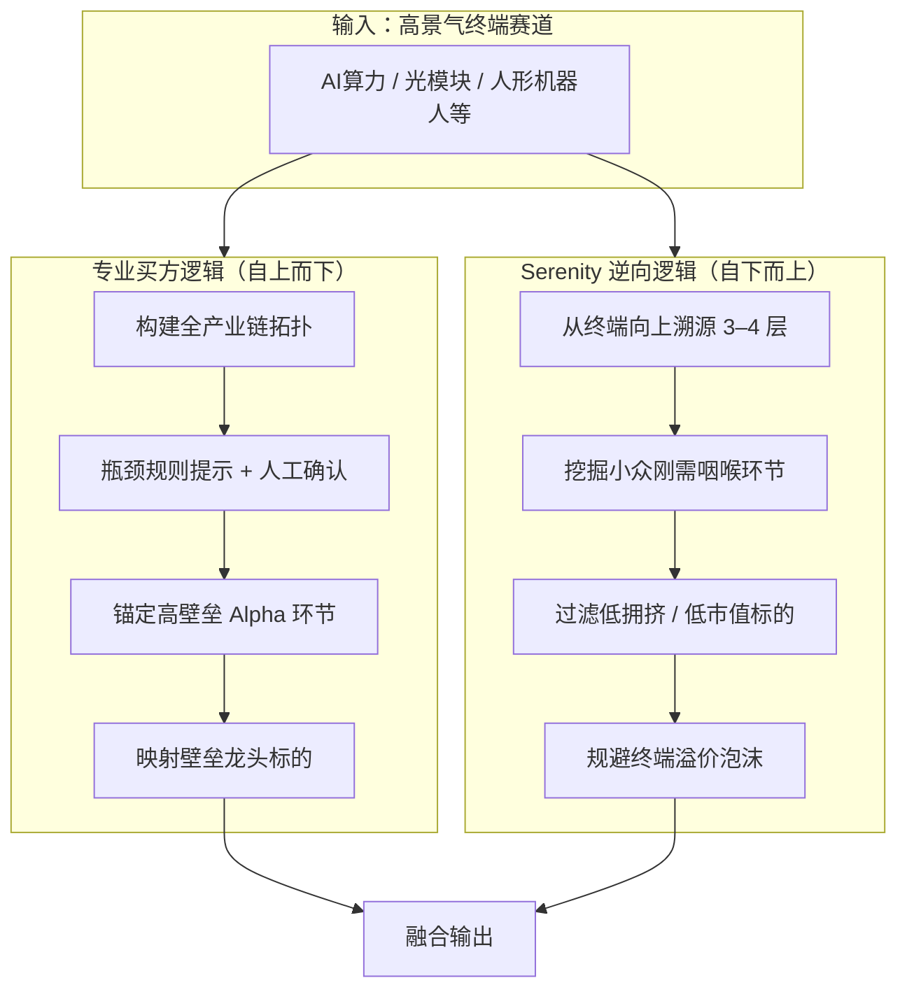
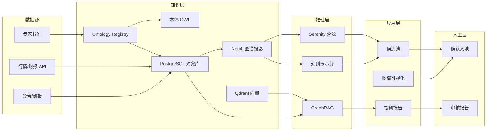
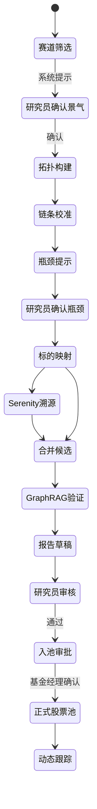

# 产业瓶颈 Alpha 智能选股系统 — 总体方案设计

> **文档版本**：v1.1  
> **最后更新**：2026-06  
> **文档性质**：本项目**唯一总方案**，整合原《产业瓶颈Alpha智能选股系统整体设计方案》与 `docs/` 目录下各分册。  
> **冲突处理**：本文档 **优先于** 原 docx 及与之矛盾的旧表述。

---

## 目录

1. [系统定位](#1-系统定位)
2. [双投研逻辑融合标准](#2-双投研逻辑融合标准)
3. [系统总体架构](#3-系统总体架构)
4. [本体建模与字段规范](#4-本体建模与字段规范)
5. [知识工程体系](#5-知识工程体系)
6. [数据蓝图](#6-数据蓝图)
7. [核心算法与推理引擎](#7-核心算法与推理引擎)
8. [业务应用层](#8-业务应用层)
9. [人机协同与投研流程](#9-人机协同与投研流程)
10. [技术栈与工程结构](#10-技术栈与工程结构)
11. [实施路径与 MVP](#11-实施路径与-mvp)
12. [评估与验证](#12-评估与验证)
13. [风险提示与合规](#13-风险提示与合规)
14. [Palantir Ontology 语义层](#14-palantir-ontology-语义层)
15. [附录](#15-附录)

---

## 1. 系统定位

### 1.1 一句话定位

**本系统是「知识驱动的定性投研辅助系统」**，以产业链知识图谱、金融本体建模、GraphRAG 大模型推理为核心技术，融合专业买方产业投研体系与 Serenity 逆向选股（紫苏叶）逻辑，辅助研究员完成赛道研判、瓶颈识别、标的筛选与逻辑验证。

> **量化打分仅作辅助排序与提示，不构成自动投资决策。**

### 1.2 建设目标

通过机器数字化、模型化、**辅助式**自动化的方式，复刻资深产业买方的主升浪选股思维，规避散户题材炒作的交易缺陷，实现：

- 产业链瓶颈挖掘与 Alpha 环节识别
- 可解释、可审计、可反驳的智能化投研
- 股票筛选、赛道研判、主升浪行情捕捉的**系统化技术支撑**

### 1.3 系统边界

#### 是什么

| 能力 | 说明 |
|------|------|
| 知识资产平台 | 沉淀产业链拓扑、瓶颈判定、证据链、专家校准记录 |
| 定性推理助手 | 辅助 Beta 赛道识别、Alpha 环节锚定、逆向溯源、风险反证 |
| 协作投研工作台 | 支持批注、复核、覆盖、投委会材料导出 |

#### 不是什么

| 类型 | 说明 |
|------|------|
| 量化交易系统 | 不做因子回测、不做自动下单、不以历史收益率为优化目标 |
| 黑盒荐股工具 | 所有结论必须附带证据链与推理路径 |
| 全自动选股机 | 最终入池、仓位、买卖时点由人工研究员确认 |
| 行情预测系统 | 不承诺收益，不输出买卖时点信号 |

### 1.4 核心能力层次

```
┌─────────────────────────────────────────────────────────┐
│  L4 人工决策层    研究员终审 · 投委会 · 仓位与风控      │
├─────────────────────────────────────────────────────────┤
│  L3 定性推理层    GraphRAG · 逻辑链生成 · 反证 · 情景分析 │  ← 核心价值
├─────────────────────────────────────────────────────────┤
│  L2 知识推理层    本体约束 · 图谱多跳 · 案例推理(CBR)    │  ← 核心价值
├─────────────────────────────────────────────────────────┤
│  L1 辅助量化层    瓶颈提示分 · 拥挤度 · 估值分位         │  ← 仅排序与提示
├─────────────────────────────────────────────────────────┤
│  L0 知识资产层    本体 · 图谱 · 溯源 · 版本 · 校准       │  ← 长期沉淀
└─────────────────────────────────────────────────────────┘
```

### 1.5 设计原则

1. **证据优先**：无证据不生成结论
2. **人机协同**：机器起草，人工定稿
3. **知识可沉淀**：每次人工修正必须回写知识库
4. **可反驳**：任何结论均可被反证推理挑战
5. **非量化优先**：新功能优先用图谱/本体/案例推理实现，再考虑辅助分数

### 1.6 系统输出物

| 输出物 | 性质 | 是否需人工确认 |
|--------|------|----------------|
| 产业链拓扑图 | 知识资产 | 新关系需专家校准 |
| 瓶颈提示分 | 辅助量化 | 否（需标注置信度） |
| 候选标的池 | 辅助清单 | **是**，入池前必须确认 |
| 投研逻辑草稿 | 定性推理 | **是**，发布前必须审核 |
| 风险反证清单 | 定性推理 | 建议人工补充 |
| 产业跟踪看板 | 数据展示 | 异常指标需人工研判 |

---

## 2. 双投研逻辑融合标准

### 2.1 两套核心逻辑（原方案 + 定稿）

#### 专业买方逻辑

搭建全产业链拓扑结构、量化供需瓶颈、跟踪产业核心指标、锚定高壁垒 Alpha 环节，吃完整赛道主升浪行情。

- **推理方向**：自上而下（赛道 → 全链拓扑 → 瓶颈环节 → 龙头）
- **收益来源**：Beta 主升浪 + Alpha 壁垒溢价
- **标的偏好**：壁垒龙头、业绩兑现
- **持仓周期**：中长期（6–24 月）

#### Serenity 逆向选股逻辑

从终端高景气赛道逆向溯源上游、挖掘小众刚需咽喉环节、偏好低拥挤度中小市值标的、规避热门终端溢价泡沫。

- **推理方向**：自下而上（终端景气 → 向上 3–4 层 → 小众环节）
- **收益来源**：低估弹性、认知差修复
- **标的偏好**：中小市值、低拥挤、低覆盖
- **持仓周期**：中短期（3–12 月）

### 2.2 逻辑关系示意



### 2.3 买方逻辑 — 可执行标准

**赛道 Beta 识别（定性为主，需研究员确认）：**

- 下游需求复合增速 > 20%（数据提示）
- 行业资本开支同比为正
- 至少 2 份独立研报支持（证据引用）
- 系统打标 `beta_candidate` → 人工确认后 `beta_confirmed`

**瓶颈环节识别（规则提示 + 人工确认）：**

满足 ≥3 项则打 `bottleneck_hint`；人工确认后升为 `bottleneck_confirmed`：

| 条件 | 阈值 |
|------|------|
| 扩产周期 | > 18 个月 |
| 客户认证周期 | ≥ 2 年 |
| 行业 CR4 | > 60% |
| 海外设备/材料依赖 | 是 |
| 短期产能缺口 | 需求增速 > 产能增速 |
| 涨价持续性 | 连续 2 季度以上 |

### 2.4 Serenity 逻辑 — 可执行标准

**输入**：共用 `beta_confirmed` 赛道库。

**逆向溯源**：从终端产品沿 `UPSTREAM_OF` 反向遍历 3–4 跳。

**小众咽喉环节（`serenity_niche`，满足 ≥4 项）：**

| 条件 | 阈值 |
|------|------|
| 产品层级 | 二级/三级耗材或材料 |
| 成本占比 | < 5% 但不可替代 |
| 替代难度 | 高 |
| 机构覆盖 | < 5 家 |
| 总市值 | < 200 亿（可配置） |
| 成交额分位 | < 30% |
| 终端龙头排除 | 非赛道市值前 3 |

### 2.5 三种融合模式

| 模式 | 路径 | 输出池 | 适用场景 |
|------|------|--------|---------|
| A 买方专业 | Beta → 拓扑 → 瓶颈确认 → 龙头 | `pool_buy_side` | 稳健主升 |
| B Serenity 逆向 | 终端 → 逆向溯源 → 小众筛选 | `pool_serenity` | 低估弹性 |
| C 双逻辑融合 | 两池并集 / 交集 / 互补 | `pool_fusion` | 高确定性 + 高弹性 |

**融合优先级：**

| 优先级 | 条件 | 含义 |
|--------|------|------|
| P0 | 同一公司同时出现在买方池与 Serenity 池 | 双逻辑共振 |
| P1 | 同赛道龙头 + 小众配套 | 组合建议草稿 |
| P2 | 仅满足单一逻辑 | 普通候选 |

> 系统生成「核心 + 弹性」组合建议，**不自动分配仓位**。

---

## 3. 系统总体架构

### 3.1 六层技术架构（原方案 + 修订）

系统采用分层解耦设计，从底层数据、知识建模、算法推理到上层业务应用逐层落地。

```
┌──────────────────────────────────────────────────────────────────┐
│  7. 前端交互层    Web · 图谱画布 · 选股面板 · 看板 · 问答        │
├──────────────────────────────────────────────────────────────────┤
│  6. 业务应用层    可视化 · 双逻辑选股 · 诊断 · 看板 · 报告       │
├──────────────────────────────────────────────────────────────────┤
│  5. 推理引擎层    规则提示分 · Serenity算子 · GraphRAG            │
├──────────────────────────────────────────────────────────────────┤
│  4. 知识抽取层    LLM抽取 · OWL校验 · 专家校准 · 增量更新        │
├──────────────────────────────────────────────────────────────────┤
│  3. 本体建模层    OWL本体 · 四大实体 · 约束规则 · 三元组关系      │
├──────────────────────────────────────────────────────────────────┤
│  2. 数据接入层    结构化金融/产业数据 + 非结构化投研文本          │
├──────────────────────────────────────────────────────────────────┤
│  1. 基础平台层    Neo4j · PostgreSQL · Qdrant · Redis · MinIO   │
└──────────────────────────────────────────────────────────────────┘
```

### 3.2 各层说明

#### 第 1 层：基础平台层

| 组件 | 选型（定稿） | 原方案 | 说明 |
|------|-------------|--------|------|
| 图数据库 | **Neo4j 5.x** | NebulaGraph + Neo4j | 一期单图库 |
| 关系库 | PostgreSQL 15+ | — | 业务、溯源、审计 |
| 向量库 | Qdrant | Milvus | 研报 RAG |
| 对象存储 | MinIO | — | PDF、原始文档 |
| 缓存/队列 | Redis + Celery | Flink + Airflow | 定时任务与异步 |
| 大模型 | DeepSeek / GLM-4 API | 领域微调 LLM | 一期 API 调用 |
| 基础能力 | 权限、审计、网关、监控 | 同左 | — |

#### 第 2 层：多源数据接入层

**结构化数据：**

- 金融：财报、营收拆分、产能、扩产计划、毛利率、CR4、PE/PB 分位
- 产业：供需数据、设备交付周期、原材料价格、认证进度、全球产能
- 供应链：上下游供应商、核心客户、营收占比、重大订单

**非结构化数据：**

- 投研文本：券商研报、会议纪要、招股书、白皮书
- 产业舆情：技术突破、涨价、扩产、政策、海外动态
- 投研逻辑：博主产业逻辑、机构方法论、赛道复盘

#### 第 3 层：金融 & 产业链本体建模层

采用 **OWL 逻辑约束 + Palantir Ontology 语义层** 双轨架构（详见 [第 14 章](#14-palantir-ontology-语义层)）：

- **OWL**：类层次、约束校验、与 FIBO 对齐
- **Ontology Registry**：Object Type / Link Type / Action Type / Function 的操作语义层
- **Neo4j**：图遍历与可视化投影

将人工投研思维固化为可识别、可计算、**可执行（Action）**、可推理的实体、属性、关系与约束。**这是系统的核心基座。**

#### 第 4 层：知识抽取与图谱构建层

```
原始文档 → 解析存储 → LLM三元组抽取 → OWL规则校验
    → draft入库 → 专家校准 → confirmed → 同步Neo4j + 向量库
```

#### 第 5 层：图谱计算 & LLM 推理引擎层

| 能力 | 定稿方案 | 原方案修订 |
|------|---------|-----------|
| 瓶颈打分 | **规则引擎提示分** | GNN 0–100 分 → 一期不用 GNN |
| Serenity | 图遍历多跳 + 剪枝 | 保留 |
| GraphRAG | 事实 + 反证 + 逻辑生成 | 保留，强制 citation |

#### 第 6 层：业务应用层

见 [第 8 章](#8-业务应用层)。

#### 第 7 层：前端交互层

React + TypeScript + Ant Design + G6，提供图谱画布、选股筛选、数据看板、报告导出、自然语言问答。

### 3.3 端到端数据流



---

## 4. 本体建模与字段规范

### 4.1 四大核心实体

#### ① 产品节点（产业链拓扑核心）

| 属性类别 | 字段 |
|---------|------|
| 基础 | 产品ID、名称、所属赛道、层级（终端/中游/材料/耗材） |
| 产业 | 成本占比、扩产周期、技术壁垒等级、替代难度、认证周期 |
| 格局 | 全球产能、CR4集中度、海外依赖度 |
| 标签 | 瓶颈状态、Serenity小众标签、提示分 |
| 动态 | 产能增速、需求复合增速、供需缺口系数、涨价周期 |

#### ② 上市公司节点

股票代码、名称、总市值、主营产品及营收占比、对应产品产能、核心客户、毛利率、机构覆盖度、估值分位、业绩增速、交易拥挤度、并购预期。

#### ③ 行业赛道节点

赛道景气周期、下游资本开支增速、需求复合增速、赛道 Beta 强度、行业政策环境。

#### ④ 产业事件节点（动态驱动）

扩产公告、设备交付、客户认证落地、产品涨价、供给限制、技术迭代、产能紧缺预警。

### 4.2 核心拓扑关系

**静态拓扑：**

| 关系 | 语义 |
|------|------|
| UPSTREAM_OF | 产品 → 产品（上游原材料） |
| DOWNSTREAM_OF | 产品 → 产品（下游应用） |
| PRODUCES | 公司 → 产品（主营生产） |
| BELONGS_TO | 产品 → 赛道 |
| SUPPLIES | 公司 → 公司（供应链） |
| TRIGGERS | 事件 → 产品（事件驱动） |

**动态量化：**

- 产品 — 供需缺口分值 — 数值
- 产品 — 壁垒打分 — 分值
- 公司 — 市场份额 — 产品

### 4.3 双投研逻辑本体约束（OWL 要点）

```turtle
:BottleneckHint a owl:Class ;
  rdfs:subClassOf :Product ;
  rdfs:label "瓶颈提示（需人工确认）"@zh .

:SerenityNiche a owl:Class ;
  rdfs:subClassOf :Product ;
  rdfs:label "Serenity小众环节"@zh .
```

完整本体文件：`ontology/aistock.owl`（持续演进）。

### 4.4 字段规范速查表

**产品节点：** 产品ID、产品名称、所属赛道、层级、下游终端列表、上游原材料列表、成本占比、扩产周期(月)、全球有效产能、产能增速、需求复合增速、供需缺口系数、CR4集中度、技术壁垒等级、海外依赖度、客户认证周期、替代难度、涨价周期、瓶颈提示分、是否瓶颈节点、是否Serenity小众环节。

**公司节点：** 股票代码、公司名称、总市值、主营产品及营收占比、对应产品瓶颈得分、机构覆盖数量、近三年毛利率、产能利用率、核心客户名单、PE历史分位、交易拥挤度、并购预期、业绩兑现增速。

---

## 5. 知识工程体系

> 本系统**核心资产是知识**，而非模型或因子。

### 5.1 知识生命周期

```
知识获取 → 知识表示 → 知识融合 → 知识推理 → 知识演化 → 知识评估
   ↑                                                      |
   └──────────────── 人工校准反馈 ←─────────────────────────┘
```

### 5.2 知识表示

| 层次 | 技术 | 内容 |
|------|------|------|
| 本体 | Protégé + owlready2 | OWL 类、属性、约束 |
| 图谱 | Neo4j 5.x | Product, Company, Sector, Event 实例 |
| 溯源 | PostgreSQL | knowledge_assertion + knowledge_provenance |
| 向量 | Qdrant | 研报 chunk 语义索引 |

> 证据与人工研判统一落在 PostgreSQL，Neo4j 仅保留产业拓扑事实，避免双套溯源模型。

### 5.3 知识元数据（每条知识必带）

```json
{
  "knowledge_id": "uuid",
  "entity_type": "Product",
  "entity_id": "prod_cowos",
  "property": "expansion_cycle_months",
  "value": 24,
  "confidence": 0.85,
  "source_type": "research_report",
  "source_ref": "研报标题/页码/URL",
  "status": "confirmed",
  "ontology_version": "1.2.0"
}
```

### 5.4 溯源原则

- **无溯源不展示**
- **多源并存**，按优先级消解
- **GraphRAG 每条论断绑定 citation**

### 5.5 知识版本管理

| 对象 | 版本方式 |
|------|---------|
| OWL 本体 | Git，`ontology/versions/vX.Y.Z/` |
| 图谱快照 | Neo4j dump + 版本号 |
| 赛道链条 | 专家校准产生新版本 |
| 配置规则 | Git + 环境变量 |

**变更流程：** draft → pending → confirmed / rejected → deprecated

### 5.6 冲突消解

**优先级：** 专家确认 > 公司公告 > 行业协会 > 头部券商研报 > 其他研报 > LLM 抽取

| 冲突类型 | 策略 |
|---------|------|
| 数值冲突 | 按优先级取主值，副值存 alternate |
| 关系冲突 | 专家确认覆盖 LLM |
| 时效冲突 | 新数据优先，旧数据 deprecated |
| 逻辑冲突 | 触发反证告警，人工复核 |

### 5.7 专家校准

| 任务类型 | SLA |
|---------|-----|
| 新赛道链条初审 | 3 工作日 |
| 瓶颈确认 | 1 工作日 |
| 冲突仲裁 | 2 工作日 |

高影响操作（瓶颈确认、入池）需**双人复核**。

### 5.8 知识质量 KPI（一期目标）

| 指标 | 目标 |
|------|------|
| 链条完整度 | ≥ 90% |
| 抽取准确率 | ≥ 85% |
| 溯源覆盖率 | 100% |
| 校准及时率 | ≥ 95% |
| 人工修正回写率 | 100% |

### 5.9 案例推理库（CBR）

预置历史复盘案例（光伏硅料、光模块/AI算力、锂电隔膜），GraphRAG 检索辅助定性判断，**非预测收益**。

### 5.10 Palantir Ontology 语义层（概要）

> 完整实现方案见 [11-palantir-ontology.md](./11-palantir-ontology.md)

借鉴 Palantir Foundry Ontology 方法论（**不依赖商业产品**），在 PostgreSQL + Neo4j 上自建语义层：

| Ontology 概念 | AiStock 实现 | 作用 |
|--------------|-------------|------|
| Object Type | Product, Company, Sector, CandidatePoolEntry… | 业务对象 |
| Link Type | upstream_of, produces, belongs_to | 产业链关系 |
| Function | calcBottleneckHint, serenityReverseTrace | 派生计算 |
| Action Type | ConfirmBottleneck, ApprovePoolEntry | **人工投研操作** |
| Object Set | BottleneckProducts, PendingCandidates | 预定义查询视图 |

**核心原则**：PostgreSQL 为 Ontology 权威存储，Neo4j 为图投影；入池/瓶颈确认等流程统一建模为 **Action**，自动审计与写回。

---

## 6. 数据蓝图

### 6.1 数据分层

```
L3  应用数据    候选池、报告、批注、审计日志
L2  知识数据    图谱、本体、向量索引、溯源
L1  清洗数据    标准化财报、公告、行业指标
L0  原始数据    PDF、API 原始响应
```

### 6.2 数据源规划

| 类别 | 主数据源 | 更新频率 |
|------|---------|---------|
| 财报/估值 | Wind 或 iFinD | 日/季 |
| 公告 | 巨潮 / 交易所 | 实时 |
| 研报 | 内部订阅 PDF | 日 |
| 产业指标 | 行业协会 + 人工维护 | 周/月 |
| 供应链 | 公告抽取 + 专家补全 | 事件驱动 |

### 6.3 A 股特有问题

| 问题 | 策略 |
|------|------|
| ST / *ST | 候选池默认排除 |
| 借壳/重组 | 标记 data_quality_warning |
| 关联交易 | 供应链关系需人工确认 |
| 拥挤度 | 北向/融资/成交额分位辅助 |

### 6.4 缺失降级原则

> **宁可缺数据，不可编造数据。**

| 缺失 | 降级 |
|------|------|
| 产能 | 该项不计分，标注缺失 |
| 上下游关系 | 不进 Serenity 路径 |
| 研报 | 报告标注「证据不足」 |

### 6.5 接入架构

```
外部 API/文件 → 适配器 → MinIO/PostgreSQL(ODS) → Celery清洗
    → 标准层 → 知识抽取/图谱同步
```

---

## 7. 核心算法与推理引擎

### 7.1 瓶颈提示分规则引擎

> **替代原方案 GNN**。一期使用透明可审计的规则引擎，输出「瓶颈提示分（Hint Score）」。

**公式：**

```
bottleneck_hint_score =
    supply_rigidity   × 0.30   # 扩产周期、海外依赖、产能利用率
  + tech_barrier      × 0.25   # 壁垒等级、认证周期、替代难度
  + supply_demand_gap × 0.25   # 供需缺口、涨价、库存
  + concentration     × 0.20   # CR4、新玩家准入
```

**提示等级：**

| 分数 | 标签 | 系统动作 |
|------|------|---------|
| ≥ 70 | hint_high | 推荐复核，可申请 bottleneck_confirmed |
| 50–69 | hint_medium | 列入观察 |
| 30–49 | hint_low | 仅展示 |
| < 30 | — | 不标注 |

**Score Card 输出规范（禁止裸分数）：**

```yaml
score_card:
  entity_id: "product:cowos"
  score_type: "bottleneck_alpha_hint"
  value: 72
  weight_breakdown:
    supply_rigidity:   { score: 22, max: 30, evidence_refs: ["ev-005"] }
    tech_barrier:      { score: 18, max: 25, evidence_refs: ["ev-006"] }
  label_hint: "疑似瓶颈环节"
  requires_human_review: true
  disclaimer: "本分数为辅助排序提示，不构成投资建议"
```

**GNN 演进路径：** 一期规则 → 二期规则+CBR → 三期（可选）GNN 辅助分项 ≤20%

### 7.2 Serenity 逆向溯源算子

**输入**：`beta_confirmed` 赛道 + 终端产品列表。

**算法**：从终端沿 `UPSTREAM_OF` 反向 DFS/BFS，深度 3–4 跳。

**产品层剪枝：** 层级为材料/耗材、成本占比低、替代难度高、非终端。

**公司层剪枝：** 市值 < 200亿、覆盖 < 5家、拥挤度 < 30%、排除赛道市值前3。

**Serenity 提示分：**

```
serenity_hint =
    niche_fit       × 0.30
  + supply_rigidity × 0.25
  + low_attention   × 0.25
  + path_quality    × 0.20
```

### 7.3 GraphRAG 可解释推理

**三级推理：**

```
Level 3  逻辑生成   赛道Beta + 瓶颈 + 标的 + 风险总结
Level 2  反证推理   技术替代 / 扩产 / 需求下滑 / 估值透支
Level 1  事实推理   图谱多跳查询 + 文档检索验证
```

**三阶段检索：**

1. 意图解析（赛道、标的、模式）
2. 混合检索（Neo4j 子图 + Qdrant 向量 Top-K）
3. 约束生成（温度 ≤0.4，强制 citation，无引用标 unverified）

**反证 Checklist（每次必检）：**

技术替代、新增扩产、需求下滑、估值透支、政策风险、客户集中度、库存累积。

> 未通过项生成风险告警，**不自动剔除标的**。

**系统 Prompt 约束：**

```
你是产业投研助手，不是投资顾问。
- 仅基于【图谱事实】和【文档摘录】推理
- 每个论点必须标注 [ref:N]
- 禁止预测股价、禁止买卖建议
- 不确定项明确说「数据不足，需人工核实」
```

**报告 status 恒为 draft**，审核后 published。

---

## 8. 业务应用层

### 模块 1：产业链拓扑可视化画布

- 全链条上下游 G6 可视化
- 节点颜色区分瓶颈等级 / Serenity 标签
- 点击展示产能、壁垒、供需、对应上市公司、提示分
- 一键逆向溯源上游小众环节

### 模块 2：双逻辑智能选股引擎（核心）

| 模式 | 筛选逻辑 | 适配 |
|------|---------|------|
| 买方专业 | 高瓶颈提示分 + 业绩兑现 + 毛利率上行 | 中长期主升 |
| Serenity 逆向 | 多层上游小众 + 低市值 + 低拥挤 | 低估弹性 |
| 双逻辑融合 | 两池并集，P0 共振优先 | 高确定性 |

### 模块 3：散户 vs 专业模式智能诊断

区分纯题材 Beta 炒作（散户陷阱）与产业壁垒 Alpha（专业主升），提示追高风险、逻辑支撑性、持仓适配性。

### 模块 4：产业指标动态跟踪看板

按月/季度刷新产能、价格、扩产进度、认证进度、供需缺口、毛利率，动态更新提示分。

### 模块 5：AI 自动投研报告生成

输出：拓扑结构、瓶颈判定依据、Beta/Alpha 拆分、Serenity 逻辑、风险反证、持仓周期建议。逻辑可追溯、可解释、**须人工审核**。

---

## 9. 人机协同与投研流程

### 9.1 设计原则

- 机器起草，人工定稿
- 关键节点必须人工确认
- 人工覆盖必须留痕并回写知识库

### 9.2 用户角色

| 角色 | 职责 |
|------|------|
| 产业研究员 | 链条校准、瓶颈确认、候选入池、报告审核 |
| 基金经理 | 组合决策、最终入池审批 |
| 风控 | 反证复核、否决权 |
| 知识管理员 | 本体版本、数据源配置 |

### 9.3 必经人工确认节点（7 个）

| 节点 | 未确认后果 |
|------|-----------|
| 赛道景气确认 | 不进入后续流程 |
| 产业链链条校准 | 关系保持 draft |
| 瓶颈标签确认 | 仅作提示，不入买方池 |
| Serenity 小众确认 | 不进 Serenity 池 |
| 报告草稿审核 | 不可对外展示 |
| **候选入池** | **不进正式股票池** |
| 风险否决 | 从候选移除 |

### 9.4 标准投研业务流程（定稿）

```
Step1  识别赛道 Beta          → 研究员确认景气
Step2  构建产业拓扑图谱        → 专家校准链条
Step3  瓶颈规则提示            → 研究员确认/否决
Step4  Serenity 逆向溯源       → 研究员筛选小众环节
Step5  GraphRAG 逻辑验证+反证  → 研究员审核草稿
Step6  分层候选池              → 研究员确认入池
Step7  动态迭代跟踪            → 事件触发复核
```

> 与原方案差异：Step3 由 GNN 自动打分改为规则提示+人工确认；Step6 由自动输出改为人工入池。

### 9.5 工作流状态图



---

## 10. 技术栈与工程结构

### 10.1 技术栈总览

| 层级 | 选型 |
|------|------|
| 前端 | React 18 + TypeScript + Vite + Ant Design + G6 + ECharts |
| 后端 | Python 3.11+ + FastAPI + Celery |
| 图数据库 | Neo4j 5.x |
| 关系库 | PostgreSQL 15+ |
| 向量库 | Qdrant |
| 缓存 | Redis 7 |
| 对象存储 | MinIO |
| 本体 | OWLready2 + Protégé |
| LLM | DeepSeek API / GLM-4 API |
| 部署 | Docker Compose + Nginx |

### 10.2 工程目录

```
aistock/
├── docs/                    # 设计文档（本文档为总册）
├── ontology/
│   ├── registry/            # Palantir Ontology 注册表（YAML）
│   │   ├── object_types.yaml
│   │   └── action_types.yaml
│   └── owl/                 # OWL 逻辑约束
├── backend/
│   ├── app/
│   │   ├── api/             # FastAPI 路由
│   │   ├── ontology/        # Ontology 运行时（二期）
│   │   │   ├── registry.py
│   │   │   ├── action_executor.py
│   │   │   └── function_runtime.py
│   │   ├── services/        # 业务逻辑（逐步注册为 Function）
│   │   │   ├── graph_store.py
│   │   │   ├── hint_score.py
│   │   │   ├── serenity_trace.py
│   │   │   ├── candidate_pool.py
│   │   │   ├── report.py
│   │   │   └── audit.py
│   │   └── data/
│   │       └── seed_ai_compute.json
│   └── config/
├── frontend/
└── docker-compose.yml
```

### 10.3 原方案技术修订对照

| 原方案 | 定稿 |
|--------|------|
| GNN 瓶颈 Alpha 量化打分 | 规则引擎提示分 |
| NebulaGraph + Neo4j | 仅 Neo4j |
| Flink 实时流 | Celery 定时任务 |
| Airflow | Celery Beat |
| Milvus | Qdrant |
| 自动化选股 | 辅助式选股 + 人工确认 |
| 全行业图谱 | 一期单赛道（AI 算力） |
| LLM 微调 | API 调用 |

### 10.4 核心技术价值

| 技术 | 价值 |
|------|------|
| 本体建模 | 投研思维标准化、可审计、可复现、可迭代 |
| 知识图谱 | 多跳关联推理，挖掘隐性上游瓶颈 |
| GraphRAG | 结构化+文本融合，可解释结论，杜绝空想 |
| 规则提示分 | 透明可审计，辅助排序，非自动决策 |
| 双逻辑融合 | 兼顾机构主升与 Serenity 低估弹性 |

---

## 11. 实施路径与 MVP

### 11.1 三期迭代（原方案 + 修订）

| 阶段 | 周期 | 目标 |
|------|------|------|
| **一期** | 0–3 月 | 单赛道基座 + 图谱可视化 + 规则提示分 + 双逻辑候选 + 人工入池闭环 |
| **二期** | 3–6 月 | GraphRAG LLM 接入 + 知识抽取流水线 + 产业指标看板 + 数据商 API |
| **三期** | 6–9 月 | Serenity 完善 + 散户诊断 + 报告发布 + 扩展多赛道 + 商用落地 |

### 11.2 一期 MVP 目标

在 **AI 算力** 单赛道跑通：

```
数据接入 → 知识抽取 → 专家校准 → 图谱展示 → 双逻辑候选 → GraphRAG 报告 → 人工入池
```

### 11.3 MVP 范围

**做：** 本体、Neo4j 图谱、G6 可视化、LLM 抽取、溯源、规则提示分、Serenity 溯源、GraphRAG 草稿、人机协同入池、产业看板。

**不做：** GNN、全行业图谱、Flink、NebulaGraph、自动交易/回测、移动端、LLM 微调。

### 11.4 MVP 里程碑

| 里程碑 | 时间 | 交付 |
|--------|------|------|
| M1 基座 | 第 1 月 | 骨架、Docker、本体 v1.0、种子图谱、图谱页面 |
| M2 知识流水线 | 第 2 月 | 公告/研报接入、LLM 抽取、校准后台、提示分引擎 |
| M3 业务闭环 | 第 3 月 | Serenity、候选池、GraphRAG 报告、案例复盘验证 |

### 11.5 MVP 当前实现状态

| 模块 | 状态 | 说明 |
|------|------|------|
| 项目骨架 | ✅ 已完成 | FastAPI + React |
| 种子数据 | ✅ 已完成 | `seed_ai_compute.json`（示意数据） |
| 内存图谱 | ✅ 已完成 | `graph_store.py`，二期换 Neo4j |
| 图谱可视化 | ✅ 已完成 | G6 页面 |
| 规则提示分 | ✅ 已完成 | `hint_score.py` |
| Serenity 溯源 | ✅ 已完成 | `serenity_trace.py` |
| 双逻辑候选池 | ✅ 已完成 | `candidate_pool.py` |
| 入池/审计 | ✅ 已完成 | 内存态，二期落库 |
| 报告生成 | ✅ 规则模板版 | 二期接 LLM GraphRAG |
| Neo4j/PostgreSQL | ⏳ 待建设 | Docker Compose 已备 |
| 真实数据接入 | ⏳ 待建设 | — |
| Ontology Registry | ✅ 已定义 | `ontology/registry/*.yaml` |
| Ontology 运行时 | ✅ 最小版 | Action/Function/ObjectSet API |

---

## 12. 评估与验证

### 12.1 评估原则

**不以历史收益率为主要指标**，采用三维评估：

1. **知识质量**（三元组准确率、链条完整度、溯源覆盖率）
2. **逻辑复现**（历史案例能否复现关键环节）
3. **人机协同效率**（报告采纳率、校准工时）

### 12.2 一期必选复盘案例

| 案例 | 验证问题 |
|------|---------|
| 光模块 2023 主升浪 | 能否识别 EML/硅光等瓶颈 |
| CoWoS 先进封装 | 逆向溯源能否找到小众材料 |
| 扩产后瓶颈缓解 | 反证能否提前提示风险 |

### 12.3 明确排除的指标

年化收益率、夏普比率、自动回测胜率、与指数超额对比。

### 12.4 验收标准（一期）

| 项 | 标准 |
|----|------|
| 端到端演示 | 赛道选择 → 入池确认全流程 |
| 逻辑复现 | 光模块/CoWoS 逻辑链可复现 |
| 溯源 | 报告关键论断 100% 可溯源 |
| 人工门控 | 无人工确认不得入正式池 |
| 性能 | 图谱 3 跳查询 < 2s |

---

## 13. 风险提示与合规

### 13.1 风险提示

本系统为智能投研辅助工具，数据更新、模型推理存在滞后性与局限性，无法规避黑天鹅事件、产业技术迭代、政策变动等风险。**系统所有输出内容仅为投研参考，不构成任何投资建议**，需人工专业研究员二次复核校验。

### 13.2 合规要求

- 所有页面固定免责声明
- 报告导出附带：生成时间、知识版本号、复核人、证据完整度
- 审计日志保留 ≥ 3 年（谁、何时、对哪条结论做了什么操作）
- 高影响操作双人复核
- 禁止输出买卖建议、禁止预测股价

---

## 14. Palantir Ontology 语义层

> 本章为总方案摘要；完整设计见 [11-palantir-ontology.md](./11-palantir-ontology.md)。注册表见 `ontology/registry/`。

### 14.1 为什么需要 Ontology 语义层

传统 OWL + 知识图谱擅长描述「世界是什么」，但投研系统是 **操作密集型** 的：研究员要确认瓶颈、校准链条、批准入池、发布报告。Palantir Ontology 将这类操作提升为与对象、关系同级的 **Action Type**，实现：

- 语义统一：应用、API、审计共用一套业务词汇
- 写回闭环：操作即状态变更 + 留痕 + 知识沉淀
- 权限内聚：按角色约束可执行的 Action
- 前端动态化：Action Schema 驱动表单，减少硬编码

### 14.2 五元组模型

```
Object Type  —  业务对象（Product, Company, Sector…）
Link Type    —  对象关系（upstream_of, produces…）
Function     —  派生计算（提示分、逆向溯源、候选池）
Action Type  —  业务操作（确认瓶颈、入池、发报告）
Object Set   —  预定义对象集合查询
```

### 14.3 架构：语义层在系统中的位置

```
数据源 → Pipeline 物化 → PostgreSQL（Ontology 权威）
                              ↓
                    Ontology 运行时（Object/Link/Function/Action）
                              ↓
              Neo4j 图投影 / API / React 应用
```

| 存储 | 职责 |
|------|------|
| PostgreSQL `ont_*` | Object/Link 权威数据 |
| PostgreSQL `knowledge_*` | 证据溯源 |
| Neo4j | 多跳遍历、G6 可视化（异步投影） |
| Redis | Function 结果缓存 |
| `ontology/registry/*.yaml` | 语义定义（Git 版本化） |

### 14.4 Object / Link 与现有本体的映射

| Object Type | 原方案实体 | 关键属性 |
|-------------|-----------|---------|
| Product | 产品节点 | bottleneck_status, serenity_niche, expansion_cycle_months |
| Company | 上市公司 | market_cap, analyst_coverage, turnover_percentile |
| Sector | 行业赛道 | status, demand_growth_hint |
| Event | 产业事件 | event_type, event_date |
| CandidatePoolEntry | 候选池条目 | mode, priority, status |
| ResearchReport | 投研报告 | logic_chain, status |
| KnowledgeAssertion | 知识断言 | property, value, provenance |

| Link Type | 原方案关系 |
|-----------|-----------|
| upstream_of | 产品-上游原材料-产品 |
| produces | 公司-主营生产-产品 |
| belongs_to | 产品-所属赛道 |
| triggers | 事件-驱动-产品 |

### 14.5 Action Type 与人工确认节点映射

| 人工确认节点（第 9 章） | Action Type |
|----------------------|-------------|
| 赛道景气确认 | `ConfirmSectorBeta` |
| 产业链链条校准 | `CalibrateChain` |
| 瓶颈标签确认 | `ConfirmBottleneck` |
| 候选入池 | `ApprovePoolEntry` |
| 候选否决 | `RejectPoolEntry` |
| 报告发布 | `PublishReport` |

每个 Action 执行：前置条件校验 → 属性/链接变更 → 审计日志 →（可选）双人复核。

### 14.6 Function 与推理引擎映射

| Function | 对应模块 | 输出 |
|----------|---------|------|
| `calcBottleneckHint` | hint_score.py | ScoreCard（提示分） |
| `serenityReverseTrace` | serenity_trace.py | TracePathList |
| `buildFusionPool` | candidate_pool.py | ObjectSet[Candidate] |
| `generateReportDraft` | report.py | ResearchReport(draft) |

### 14.7 OWL 双轨制

| 层 | 技术 | 职责 |
|----|------|------|
| 逻辑约束 | OWL + owlready2 | 矛盾检测、类推理、FIBO 对齐 |
| 操作语义 | Ontology Registry | 对象、操作、权限、物化 |
| 图遍历 | Neo4j | 可视化与多跳查询 |

### 14.8 API 演进

```
# 一期（已有）
POST /api/v1/candidates/confirm

# 二期（Ontology-native，逐步迁移）
POST /api/v1/ontology/actions/ApprovePoolEntry/execute
GET  /api/v1/ontology/object-sets/PendingCandidates
POST /api/v1/ontology/functions/calcBottleneckHint/invoke
GET  /api/v1/ontology/registry/action-types   # 前端动态表单
```

### 14.9 实施路线

| 阶段 | 交付 |
|------|------|
| 一期增强 | Registry YAML、`action_executor` 最小版、Function 注册 |
| 二期 | PostgreSQL 物化、`graph_projector`、Pipeline 接入 |
| 三期 | 双人复核内置、OWL 一致性校验、Object Set 告警 |

---

## 15. 附录

### 15.1 原方案 vs 定稿 — 完整修订对照

| # | 原方案 | 定稿 |
|---|--------|------|
| 1 | 系统定位：智能化投研 + GNN 量化 | **知识驱动的定性投研辅助系统** |
| 2 | GNN 0–100 分自动判定瓶颈 | 规则提示分 + 人工 `bottleneck_confirmed` |
| 3 | 标准化、自动化选股 | 标准化、**辅助式**选股 + 人工入池 |
| 4 | NebulaGraph + Neo4j | 仅 Neo4j |
| 5 | Flink + Airflow | Celery + Celery Beat |
| 6 | Milvus | Qdrant |
| 7 | 全行业产业链图谱 | 一期 AI 算力单赛道 |
| 8 | LLM 领域微调 | DeepSeek/GLM-4 API |
| 9 | 得分≥70 为核心 Alpha | ≥70 为高提示，需人工确认 |
| 10 | 无知识溯源/版本设计 | 完整知识工程体系 |
| 11 | 无操作语义层 | **Palantir Ontology 语义层（自建）** |

### 15.2 API 端点一览

| 方法 | 路径 | 说明 |
|------|------|------|
| GET | `/api/v1/health` | 健康检查 |
| GET | `/api/v1/sectors` | 赛道列表 |
| POST | `/api/v1/sectors/{id}/confirm` | 确认赛道景气 |
| GET | `/api/v1/graph/sector/{id}` | 产业子图 |
| GET | `/api/v1/graph/product/{id}/hint-score` | 产品提示分 |
| GET | `/api/v1/candidates` | 候选池 |
| POST | `/api/v1/candidates/confirm` | 入池/否决 |
| POST | `/api/v1/reasoning/graphrag` | 生成报告草稿 |
| POST | `/api/v1/reasoning/reports/{id}/review` | 审核报告 |
| POST | `/api/v1/ontology/actions/{type}/execute` | 执行 Ontology Action（二期） |
| GET | `/api/v1/ontology/object-sets/{name}` | 查询对象集（二期） |
| POST | `/api/v1/ontology/functions/{name}/invoke` | 调用 Ontology Function（二期） |

### 15.3 分册文档索引

本文档为总册。各专题详见：

| 分册 | 文件 | 主题 |
|------|------|------|
| 系统定位 | `00-system-positioning.md` | 定性/量化边界 |
| 双逻辑融合 | `01-dual-logic-fusion.md` | 买方 + Serenity |
| 知识工程 | `02-knowledge-engineering.md` | 溯源、版本、校准 |
| 人机协同 | `03-human-in-loop.md` | 确认节点、审计 |
| GraphRAG | `04-graphrag-design.md` | 三级推理、反证 |
| Serenity 算法 | `05-serenity-algorithm.md` | 逆向溯源伪代码 |
| 提示分引擎 | `06-hint-score-engine.md` | 规则打分 |
| 数据蓝图 | `07-data-blueprint.md` | 数据源、SLA |
| MVP 范围 | `08-mvp-scope.md` | 一期交付 |
| 评估验证 | `09-evaluation.md` | 复盘案例 |
| 技术栈 | `10-tech-stack.md` | 前后端选型 |
| Palantir Ontology | `11-palantir-ontology.md` | 语义层实现 |

### 15.4 快速启动

```bash
# 基础设施（可选，二期必需）
docker compose up -d

# 后端
cd backend && pip install -r requirements.txt
uvicorn app.main:app --reload

# 前端
cd frontend && npm install && npm run dev
```

访问：http://localhost:5173

---

*— 文档结束 —*
